Analysis of censored PCB data using regression imputation (main report)
Gv4
================
Marc Roddis
6/20/2020

## Introduction

The Swedish National Monitoring Programme for Contaminants (SNMPC) in
freshwater biota has various goals and large scope (citation needed).
Our main goal in this study was to explore the viability of alternative
methodologies for the processing of censored data and to compare these
alternatives with the methodology used by SNMPC. At the outset, we
limited the scope of our study by choosing to focus on the estimation of
long-term time trends for the concentration of polychlorinated biphenyls
(PCBs) in biological samples. Our main idea was that since PCBs have
similar chemical and physical properties their concentrations may be
correlated such that censored measurements can be substituted using
regression imputation, which could then be used to draw better
conclusions compared with the methodology used by SNMPC.

Our study began with a large dataset `pcb.csv`, which has 5056
observations of 18 variables; these variables included: measured
concentrations of seven PCBs (CB28, CB53, CB101, CB118, CB138, CB153,
CB180); year (1984-2017); an ID for each observation; and nine other
variables such as species and age. We first performed exploratory data
analysis on this dataset to allow us to focus on the most important and
relevant observations and variables for our purpose. We then performed
simple computations on that data to obtain reasonable values for the two
fixed parameters and three variables for each of our simulation-based
studies; finally, a time-trend was fitted from each such study, which
was compared with the corresponding time-trend reported by SNMPC. We
then evaluated and summarised our findings.

## Exploratory data analysis (EDA)

### The goals of our EDA

Our EDA had five main goals:

1.  To identify censored, missing or bad observations, and calculate the
    proportions of such values in the dataset `pcb.csv`.

2.  To check the viability of our main idea by quantifying the degree
    and strength of association between PCB concentrations.

3.  To check that the pcb concentrations in our dataset have approximate
    log-normal distributions.

4.  To identify which PCBs to focus on for further study.

5.  To identify confounding variables for both the associations of PCB
    concentrations with one another and with time. We wanted to use as
    many observations as possible whilst keeping manageable scope.

#### Characteristics of censored, missing or bad observations in the dataset `pcb.csv`

To address goal 1 (see above) we imported and viewed the given dataset
`pcb.csv` and saw that there are 5056 observations of 18 variables. We
also saw that NA values are coded in various ways so we first replaced
all such values explicitly with `NA`. Concretely, this meant that all NA
values coded as \(-99.99\), \(-9.0000\), \(0\) or \(0.0000\) were
substituted for `NA`.

We then saw that there were only 6 `NA` values for CB138 and only 28
`NA` values for CB153, whereas there were many more NA values in the
data for the other pcb concentrations. Moreover, all observations (with
only one exception) which have an NA value for CB153 also have NA values
for all variables except CB138. So we removed these 28 sparse
observations, which gave the reduced dataset `pcb_tib3`, which has
\((631, 565, 125, 71, 0, 0, 44)\) NA values for (CB28, CB52, CB101,
CB118, CB138, CB153, CB180), respectively.

The CB138 variable of the `pcb_tib3` dataset has 11 censored
observations. For every one of these observations the only uncensored
value is for CB153, whereas the values for the other 6 PCBs are given by
one of two negative values, whereby CB138 and CB180 have the same value
as one another, and the four values for CB28, CB52, CB101 and CB118 are
equal to one another. So we chose to remove these 11 sparse
observations, which resulted in `pcb_tib4`, which has 5017 observations.
Our motivation is that `pcb_tib4` has no censored values and no missing
values for both CB138 and CB153; this allows us to perform preliminary
linear regression analysis to determine the strength of association
between CB138 and CB153 and fulfil goal 2.

To address goal 3, we first viewed histograms of the pcb concentrations
CB138 and CB153 (shown below); we see that these distributions each have
a large left-skew.

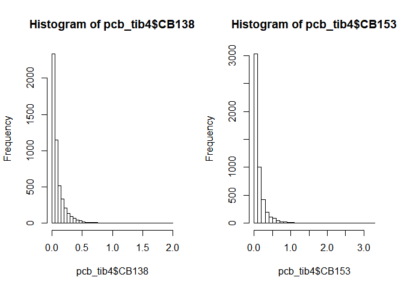<!-- -->

Histograms (not shown) of the logarithm (with bases: 2, \(e\), 10, 100
and 1000 respectively) of the CB153 data, showed that the shape of the
distribution does not change noticeably when we change the base of the
logarithm. We will therefore use base \(e\) (as is standard practice)
throughout the remainder of this report. Histograms for \(log(CB138)\)
and \(log(CB153)\) are displayed below. We see that each of these
distributions still has some (but much less) left-skew and that each
loosely approximates the shape of a normal distribution. We will
therefore make the working assumption from now on that the data for each
of our seven PCBs of interest has a log-normal distribution.

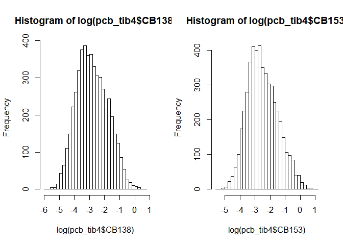<!-- -->

#### The degree and strength of association between PCB concentrations

Since the data for CB153 was most complete in the original dataset
`pcb.csv` we will view CB153 as the predictor variable (denoted by x and
shown on the horizontal axis) throughout our analysis. We will use
“response variables” to denote the variables that we make predictions
for, “response variables” (denoted by y and shown on the vertical axis).
We first display a scatter plot for \(y=CB138\) versus \(x=CB153\); the
second scatter plot shows \(y=log(CB138)\) versus \(x=log(CB153)\).

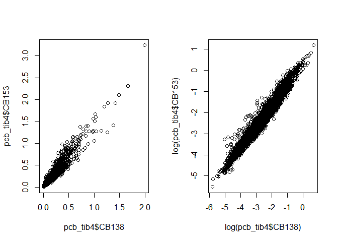<!-- -->

Linear models corresponding to the two previous scatter plots were
fitted. The Adjusted R-squared value for the model with \(y=log(CB138)\)
and \(x=log(CB153)\) was \(0.957\), whereas the corresponding value was
\(0.931\) for the model without logarithms. This indicates stronger
correlation between the logarithms of the PCB concentrations than
between the PCB concentrations themselves. So from now on, we will use
logarithm-transformed data for all our linear regression analyses.

This preliminary regression analysis demonstrates the feasibility of our
approach: to use the fact that PCB concentrations are strongly
correlated to make predictions for censored values and for missing
values.

#### Confounding variables for both the associations of PCB concentrations with one another and with time

We begin with `pcb_tib4` which was created as described in my document
“Cleaning the pcb dataset”. We will first mutate `pcb_tib4` (and
denote this mutated tibble as `pcb_tib4m`) so that it contains the
logarithms of the concentrations of CB138 and CB153 instead of the
concentrations themselves. In this document we will produce explore the
effect of various variables on the appearance of the scatter plot, and
also on the Adjusted R-squared and slope coefficient for a fitted linear
model in each case. We begin by looking at the effect of location `LOC`
followed by `SPECIES`, age `ALDR`, `YEAR`, percentage fat `FPRC`.
Throughout this document, we use y = CB153 and x = CB138 (note: x and y
are in the opposite sense here to their sense in “Cleaning the pcb
dataset”).

##### Exploring the variable location `LOC`

We first get an overview by showing a scatter plot of all observations,
colour coded by location (this is a colour coded version of the previous
plot). We see that there are too many locations (27, to be precise) to
display clearly in a single plot.

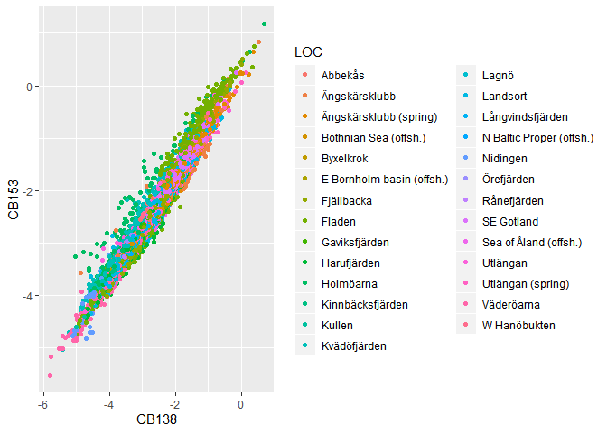<!-- -->

We then created and viewed 27 separate scatter plots, each showing the
observations from a single location. Every one of these plots showed
strong (adjusted \(R^2\) \> 0.9) positive correlation between the
concentrations of CB138 and CB153.

The four plots shown below illustrate that the data from different
locations showed associations of various (albeit rather similar)
strengths. In addition the plot for Fladen shows possible clustering,
which is explored in the next sub-section.

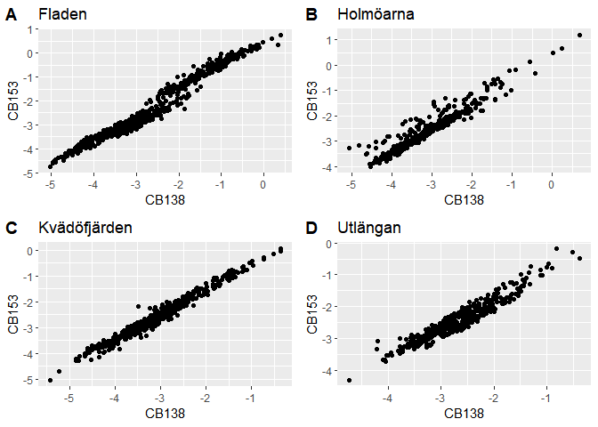<!-- -->

##### Observations from Fladen show clustering by `SPECIES`

We saw that the scatter plot of observations from Fladen showed a
curious disjointed appearance. We then created and viewed a series of
plots in which the points on the plot were colour coded according to
values of the other variables. These colour-coded plots showed no
noticeable pattern of interest, with one exception; colour-coding by
species resulted in the plot shown below which appears to show two
distinct clusters for the two species present at this location. This
leads us to believe that species could be a confounding variable with
respect to the association between CB138 and CB153.

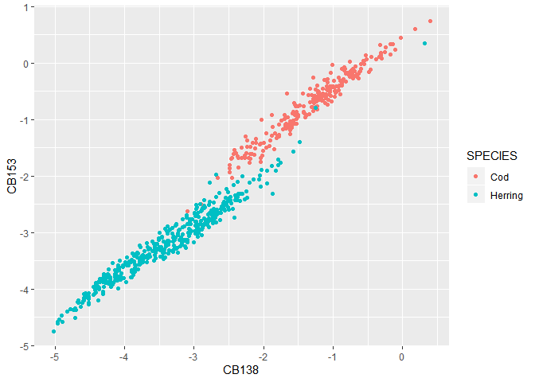<!-- -->

We show below a scatter plot of all 5017 observations from `pcb_tib4m`,
colour coded by species (this is a colour coded version of the first
scatter plot in this EDA section of this report). We augment this
qualitative view with a more quantitative analysis in the next section.

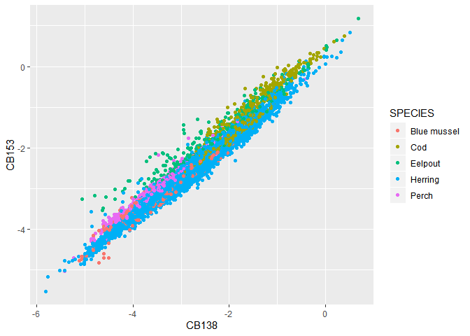<!-- -->

##### Association between CB138 and CB153 concentration: Confounding by `SPECIES`

We will now create sub-tibbles by filtering by species, and display the
corresponding scatter plot from each. The plots below each show all of
the observations from a single species.

We will now fit five linear models for y=CB153 and x=CB138, one for each
of the five species present in the `pcb.csv` dataset to explore our
conjecture that species is a confounding variable for the association
between x and y and to see whether we obtain higher R-squared values
from these five models. The adjusted R-squared values are (0.911, 0.933,
0.940, 0.971, 0.964) and the slope coefficients are (0.926, 0.904,
1.061, 0.844, 0.892) for (Blue mussel, Cod, Eelpout, Herring, Perch)
respectively.

##### Looking for evidence of confounding from location `LOC`

We will now focus solely on observations from herring. We find that
there are six locations that each have over 30 observations for herring.
We will now fit six linear models for y=CB153 and x=CB138, one for
observations from herring from each these six locations. The adjusted
R-squared values are (0.956, 0.953, 0.960, 0.915, 0.953, 0.950) and the
slope coefficients are (0.875, 0.831, 0.914, 0.868, 0.831, 0.948) for
(Ängskärsklubb, Fladen, Landsort, Utlängan, Utlängan (spring),
Väderöarna) respectively. The R-squared values are all within the
interval \[0.95, 0.96\] except for Utlängan (0.915). These results do
not show clear evidence of confounding by location and more detailed
analysis is omitted because it lies outside the scope of this report.

##### Looking for evidence of confounding from age `ALDR`

We will now proceed with data for herring from Landsort by first
displaying a scatter plot grouped by age `ALDR`. No confounding or
clustering by age can be discerned from this plot. Two linear models
were then fitted: one for the 169 fish aged 2-3 and one for the 254 fish
aged 5-7. The adjusted R-squared values are (0.894, 0.922) and the slope
coefficients are (0.893, 0.859) for (2-3 years old, 4-7 years old)
respectively; these values are quite similar so we will not view `ALDR`
as a confounding variable at this stage, so we will not filter by
`ALDR`.

##### Looking for evidence of confounding from age `ALDR`

We will now explore grouping by `YEAR`. The scatter plot shown below is
grouped by `YEAR` and shows distinct clustering, so we will next explore
filtering by `YEAR`.

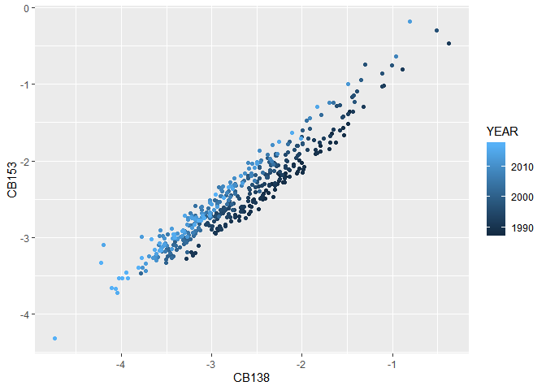<!-- -->

We will begin by fitting two linear models: one for the 208 observations
from the 20th century and one for the 215 observations from the 21st
century. The adjusted R-squared values are (0.928, 0.954) and the slope
coefficients are (0.993, 0.997) for (20th century, 21st century)
respectively. The slope coefficients are remarkably similar for the two
centuries, so we will not filter by `YEAR`.

##### Looking for evidence of confounding from fat percentage `FPRC`

We will now explore whether we should filter by fat percentage `FPRC`.
The adjusted R-squared values are (0.956, 0.929, 0.931, 0.967) and the
slope coefficients are (0.879, 0.815, 0.763, 0.964) for fat percentages
that are (LOW, MEDIUM, HIGH, VHIGH) respectively. Although these slope
coefficients do show some variation, these values decrease then
increase, so there is no clear pattern. Moreover the adjusted R-squared
values are all in the fairly narrow interval \[0.929, 0.967\], so there
is no clear evidence for filtering the dataset by `FPRC` so we will not
do this.

#### Conclusions from our EDA

In summary, we have explored possible confounding variables. We conclude
that we should view `SPECIES` as a confounding variable because the
scatter plot for herring from Fladen showed distinct clusters for “Cod”
and “Herring” and the slope coefficient for a linear model fitted to
observations from eelpout was 26 % larger than the corresponding value
from herring.

A possible conclusion indicated by weak evidence is that location `LOC`
could also be a weak confounder; the scatter plots for different
locations did show some differences of appearance. However, we did try
fitting some linear models for a few different locations and saw little
difference in slope coefficients. We therefore decided that it is not
necessary to view `LOC` as a confounder for the analysis that follows.
Moreover, our goal is to not exclude observations unless there is solid
evidence that this is advantageous.

For all the analyses that follow in the remainder of this report, we
will use observations from herring exclusively. Our starting (largest)
dataset `pcb_tib4h` (3269 observations) for all subsequent analysis was
obtained from the original dataset (5056 observations) by removing: 28
observations that have NA values for all variables except CB138; all 11
observations for which the CB138 value was censored; all observations
except those for herring.

## The design of our simulation-based studies: High-level description

Our exploratory data analysis showed that the observations of pcb
concentrations were most complete for CB153 and least complete for CB28.
So we will use the complete data for \(x=CB153\) and the strong
correlation between \(x=CB153\) and \(y=CB28\) to impute values for the
censored observations of CB28. We will perform simulations studies in
which we investigate the effect of the three variables `sd`, `beta` and
`LOD`: `sd` represents the standard deviation of CB28, `beta` represents
the slope of the linear regression line when \(x=YEAR\) and \(y=CB28\),
`LOD` represents the level of detection, which is the threshold value
used to determine whether an observation gets censored or not.

Our simulation studies will inform us as to how robust or sensitive our
imputations are to the values of these three variables. Ideally such
sensitivity would be as low as possible because then the imputations
would be as generally applicable as possible.

We will use fixed values for the parameters `sd_cb` and `beta_cb`:
`sd_cb` represents the standard deviation of CB153 which we hold fixed
at the value calculated from the dataset because the data for CB153 is
complete, `beta_cb` represents the slope of the linear regression line
when \(x=CB153\) and \(y=CB28\).

The estimation of appropriate values for these fixed and variable
parameters is described in the following sections.

### Estimation of appropriate values for the fixed parameters beta\_cb and sd\_cb

We will find estimates for `beta_cb` and `sd_cb` from various approaches
and compare these estimates.

We will use three main approaches for dealing with censored
observations, which we denote as \(C_i\):

1.  Substitution of \(C_i\) with \(abs(C_i)/\sqrt(2)\) for all i.

2.  Omission of \(C_i\) for all i.

3.  Keeping all \(C_i\) and using the cenreg() method to fit models,
    which provide estimates for `beta_cb` and `sd_cb`.

For approach 1 we will use two “sub-approaches” for dealing with the
missing values, which we denote as \(M_i\):

1a. Omission of \(M_i\) for all i.

1b. Use multiple imputation (MI) to impute all missing values,
substitute every \(M_i\) with its imputed value, fit a linear model to
the resulting “completed” dataset, and obtain parameter estimates from
the fitted model.

We will first calculate parameter estimates directly as stated above
without calculating annual means for pcb concentrations. We will then
perform the same calculation except that we will use annual means. We
will then attempt to evaluate whether or not it would be more
appropriate for us to use annual means in our subsequent work.

#### Approach 1 (Substitution of \(C_i\) with \(abs(C_i)/\sqrt(2)\) for all i)

We will first create our the dataset `vB1` by substitution of \(C_i\)
with \(abs(C_i)/\sqrt(2)\) for all i, re-coding all missing values as
`NA`, and substituting every concentration value with the natural
logarithm of its value. We will then use two approaches for the
estimation of beta\_cb and sd\_cb:

1a. Estimation from linear models fitted to `vB1` with omission of
missing values.

1b. Use of multiple imputation (MI). To do this, we start with `vB1` and
then create `completed_vB1` by replacing missing values with values
obtained by MI. We then perform estimation from linear models fitted to
`completed_vB1`. Our methodology is based on Van Buuren’s book “Flexible
Imputation of Missing Data”.

#### Estimation of beta\_cb and sd\_cb from linear models fitted by omission of missing values (approach 1a)

The most basic approach is to use `na.action = na.omit` in `lm()` to
perform listwise deletion. A drawback of this approach is loss of
information, for example we get “631 observations deleted due to
missingness” for `CB28 ~ CB153` or 954 deleted for `CB28 ~ CB52`. “If
the data are MCAR, listwise deletion produces unbiased estimates of
means, variances and regression weights. Under MCAR, listwise deletion
produces standard errors and significance levels that are correct for
the reduced subset of data, but that are often larger relative to all
available data. A disadvantage of listwise deletion is that it is
potentially wasteful. \[…\] If the data are not MCAR, listwise deletion
can severely bias estimates of means, regression coefficients and
correlations.” However, “There are cases in which listwise deletion can
provide better estimates than even the most sophisticated procedures.”
(see Section 2.6). Moreover, “Little and Rubin (2002) argue that it is
difficult to formulate rules of thumb since the consequences of using
listwise deletion depend on more than the missing data rate alone.”

Therefore despite its stated drawbacks, we begin by fitting linear
models by omission of missing values. We obtain the values (-0.054,
-0.046) for (beta\_cb28, beta\_cb153) respectively. We will later
compare the parameters obtained from the simple approach with those
obtained by imputation. Note that we are using beta\_cb153 to guard
against erroneous results since we know that the values obtained here
and by MI later must be equal because vB1h$CB153 contains no missing
values.

The adjusted R-squared value for the fitted linear model for \(x=YEAR\),
\(y=CB28\) was 0.41.

    ## 
    ## Call:
    ## lm(formula = CB28 ~ CB153, data = vB1h, na.action = na.omit)
    ## 
    ## Residuals:
    ##      Min       1Q   Median       3Q      Max 
    ## -1.97235 -0.29220 -0.01061  0.26208  2.11797 
    ## 
    ## Coefficients:
    ##              Estimate Std. Error t value Pr(>|t|)    
    ## (Intercept) -3.926171   0.027789 -141.28   <2e-16 ***
    ## CB153        0.564218   0.009789   57.63   <2e-16 ***
    ## ---
    ## Signif. codes:  0 '***' 0.001 '**' 0.01 '*' 0.05 '.' 0.1 ' ' 1
    ## 
    ## Residual standard error: 0.4781 on 2796 degrees of freedom
    ##   (471 observations deleted due to missingness)
    ## Multiple R-squared:  0.543,  Adjusted R-squared:  0.5428 
    ## F-statistic:  3322 on 1 and 2796 DF,  p-value: < 2.2e-16

    ## 
    ## Call:
    ## lm(formula = CB28 ~ YEAR, data = vB1h, na.action = na.omit)
    ## 
    ## Residuals:
    ##      Min       1Q   Median       3Q      Max 
    ## -2.11361 -0.39907 -0.04991  0.33942  2.93000 
    ## 
    ## Coefficients:
    ##               Estimate Std. Error t value Pr(>|t|)    
    ## (Intercept) 102.203031   2.441586   41.86   <2e-16 ***
    ## YEAR         -0.053745   0.001219  -44.09   <2e-16 ***
    ## ---
    ## Signif. codes:  0 '***' 0.001 '**' 0.01 '*' 0.05 '.' 0.1 ' ' 1
    ## 
    ## Residual standard error: 0.5432 on 2796 degrees of freedom
    ##   (471 observations deleted due to missingness)
    ## Multiple R-squared:  0.4101, Adjusted R-squared:  0.4099 
    ## F-statistic:  1944 on 1 and 2796 DF,  p-value: < 2.2e-16

    ## 
    ## Call:
    ## lm(formula = CB153 ~ YEAR, data = vB1h, na.action = na.omit)
    ## 
    ## Residuals:
    ##     Min      1Q  Median      3Q     Max 
    ## -3.1805 -0.6038 -0.0309  0.5581  3.0440 
    ## 
    ## Coefficients:
    ##              Estimate Std. Error t value Pr(>|t|)    
    ## (Intercept) 88.546167   3.310221   26.75   <2e-16 ***
    ## YEAR        -0.045557   0.001654  -27.54   <2e-16 ***
    ## ---
    ## Signif. codes:  0 '***' 0.001 '**' 0.01 '*' 0.05 '.' 0.1 ' ' 1
    ## 
    ## Residual standard error: 0.8315 on 3267 degrees of freedom
    ## Multiple R-squared:  0.1885, Adjusted R-squared:  0.1882 
    ## F-statistic: 758.7 on 1 and 3267 DF,  p-value: < 2.2e-16

#### Estimation of beta\_cb and sd\_cb from multiple imputation (MI) of missing values (approach 1b)

##### Why MI was chosen

We will not use pairwise deletion since it is not generally applicable
and falls outside the scope of this study, “Pairwise deletion should
only be used if the procedure that follows it is specifically designed
to take deletion into account.” We will instead focus on using various
functions from the `mice` package for performing imputation in various
ways.

We will not use mean imputation since “Mean imputation is a fast and
simple fix for the missing data. However, it will underestimate the
variance, disturb the relations between variables, bias almost any
estimate other than the mean and bias the estimate of the mean when data
are not MCAR. Mean imputation should perhaps only be used as a rapid fix
when a handful of values are missing, and it should be avoided in
general.”

Regression imputation was used in our earlier report “Preliminary
studies of censored data”. However, the scatter plots showed that the
imputed data lay perfectly on the regression line. Ad hoc addition of
noise gave realistic looking scatter plots, however this report aims to
use theory-based rather than ad hoc approaches whenever possible, so we
will not explore regression imputation any further in this report.

The mice package allows us to perform theory based “Stochastic
regression imputation” (see Section 3.2), which is a potential areas for
further study later in this report. However, this method also has the
clear drawback that it can generate implausible values such as negative
values.

Based on what we have learnt so far, we view the other methods given by
van Buuren on page 16 as outside the scope of our study. We will choose
Multiple Imputation (MI) following the main recommendations from van
Buuren’s book.

##### Creation of the dataset `completed_vB1` by MI using the `mice` algorithm

For our second attempt at MI, we first the `quickpred()` function (see
vBed2p169 and
<https://www.rdocumentation.org/packages/mice/versions/3.8.0/topics/quickpred>)
and then perform multiple imputation using `mice()` and fill in the
missing values with `complete()`. The output below first compares CB28
from `vB1h` (which has 471 missing values) with CB28 from
`completed_vB1` (which has no missing values). Then linear models with
all significant predictors are fitted for each PCB concentration from
the `completed_vB1` dataset. There are approximately 10 significant
predictors for the fitted model for each PCB concentration. Although
trends in PCB concentration with time have been the main focus of
reports based on datasets similar to this one, `YEAR` is not even
significant for every PCB.

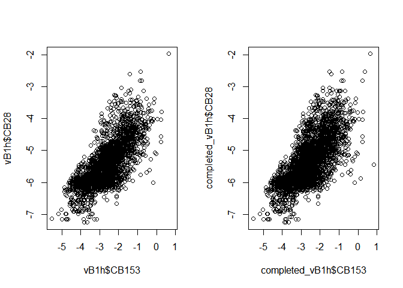<!-- -->

My main motivation for fitting and viewing all the above linear model
sumaries was to see whether the number of predictors was associated with
the number of imputed values because I considered such an association to
be plausible since this was clearly the case for linear regression
imputation. However, the summary output above shows that there is no
such clear association, so this seems to be show an advantage of
multiple imputation over regression imputation. This is consistent with
(vB page 128) “it may seem that imputation would artificially strengthen
the relations of the complete data model, which would be clearly
undesirable. If done properly however, this is not the case.”

##### Estimation of beta\_cb and sd\_cb from linear models fitted to dataset `completed_vB1`

We used MI to replace NA values of CB28 with imputed values which
allowed us to calculate the standard deviation of (the logarithm of)
CB28 from the completed dataset. We obtained the values (-0.055, -0.046,
0.74, 0.92) for (beta\_cb28, beta\_cb153, sd\_cb28, sd\_cb153)
respectively; these values are used to choose baseline parameter value
for our simulation studies as described below. We also see that the
value beta\_cb28=-0.055 we obtained by MI is very similar to the value
beta\_cb28=-0.054 that we obtained initially by simple omission of
missing values. We did indeed get identical values for beta\_cb153 by
both methods, so our MI analysis passed this simple quality control.

    ## [1] NA

    ## [1] 0.9228927

    ## [1] 0.7409927

    ## [1] 0.9228927

    ## 
    ## Call:
    ## lm(formula = CB28 ~ YEAR, data = completed_vB1h)
    ## 
    ## Residuals:
    ##      Min       1Q   Median       3Q      Max 
    ## -2.20809 -0.40929 -0.05207  0.36259  2.91583 
    ## 
    ## Coefficients:
    ##               Estimate Std. Error t value Pr(>|t|)    
    ## (Intercept) 105.265353   2.226742   47.27   <2e-16 ***
    ## YEAR         -0.055274   0.001113  -49.68   <2e-16 ***
    ## ---
    ## Signif. codes:  0 '***' 0.001 '**' 0.01 '*' 0.05 '.' 0.1 ' ' 1
    ## 
    ## Residual standard error: 0.5594 on 3267 degrees of freedom
    ## Multiple R-squared:  0.4303, Adjusted R-squared:  0.4302 
    ## F-statistic:  2468 on 1 and 3267 DF,  p-value: < 2.2e-16

    ## 
    ## Call:
    ## lm(formula = CB153 ~ YEAR, data = completed_vB1h)
    ## 
    ## Residuals:
    ##     Min      1Q  Median      3Q     Max 
    ## -3.1805 -0.6038 -0.0309  0.5581  3.0440 
    ## 
    ## Coefficients:
    ##              Estimate Std. Error t value Pr(>|t|)    
    ## (Intercept) 88.546167   3.310221   26.75   <2e-16 ***
    ## YEAR        -0.045557   0.001654  -27.54   <2e-16 ***
    ## ---
    ## Signif. codes:  0 '***' 0.001 '**' 0.01 '*' 0.05 '.' 0.1 ' ' 1
    ## 
    ## Residual standard error: 0.8315 on 3267 degrees of freedom
    ## Multiple R-squared:  0.1885, Adjusted R-squared:  0.1882 
    ## F-statistic: 758.7 on 1 and 3267 DF,  p-value: < 2.2e-16

Although we have compared parameters obtained by MI with those obtained
by omission and we have performed a simple check, we have not evaluated
the quality of our MI analysis. To do so, we could perform a comparison
with two main alternatives: Joint Modeling (JM) and Fully Conditional
Specification (FCS) and compare the outcomes in relation to van Buuren’s
conclusion (page 121) “For general missing data patterns, both JM and
FCS approaches can be used to impute multivariate missing data. JM is
the model of choice if the data conform to the modeling assumptions
because it has better theoretical properties.The FCS approach is much
more flexible and allows for imputations close to the data. Lee and
Carlin (2010) provide a comparison between both perspectives.” Such an
evaluation however, is outside the scope of this report. Moreover since
the values of beta\_cb28 obtained by MI and by omission were so similar,
we would likely also obtain similar values using JM and FCS, which would
make it difficult to distinguish between such alternative methodologies.

#### Approach 2A

We show below a scatter plot and fitted linear model summary for CB28
versus YEAR from `CB28_filtered4h`; this dataset was created from
`pcb_tib4h` by removal of all censored observations \(C_i\). The fitted
linear model for \(x=YEAR\), \(y=CB28\) has na.omit as the na.action by
default; for this model, the slope coefficient is -0.045; SE = 0.0018;
p-value \< 2e-16; Adjusted R-squared = 0.29.

#### Approach 2B

Approach 2B gave no additional insights and gave parameters estimates
that were similar to those from the other approaches so further details
are omitted for the sake of brevity.

#### Approach 3: Use of the cenreg() method

In this approach we used the cenreg() method to fit a linear model for
dataset `pcb_tib4h` without removing or substituting censored values,
instead the information contained in the censored values is used to
obtain the fitted model `tib4h_cenreg_28` for \(x=YEAR\), \(y=CB28\);
this model gives a the likelihood-r value 0.54.

    ## Loading required package: survival

    ## 
    ## Attaching package: 'NADA'

    ## The following object is masked from 'package:stats':
    ## 
    ##     cor

    ## Warning in Surv(start, end, type = "interval2"): Invalid interval: start > stop,
    ## NA created

    ##                         Value Std. Error     z         p
    ## (Intercept)           85.8856    3.51302  24.4 5.31e-132
    ## pcb_tib4h_CB28CI$YEAR -0.0455    0.00176 -25.9 9.08e-148
    ## Log(scale)            -0.5747    0.01749 -32.9 7.01e-237
    ## 
    ## Scale = 0.563 
    ## 
    ## Gaussian distribution
    ## Loglik(model)= -1380.3   Loglik(intercept only)= -1661.1 
    ## Loglik-r:  0.5391951 
    ## 
    ## Chisq= 561.66 on 1 degrees of freedom, p= 0 
    ## Number of Newton-Raphson Iterations: 4 
    ## n =1635 (1163 observations deleted due to missingness)

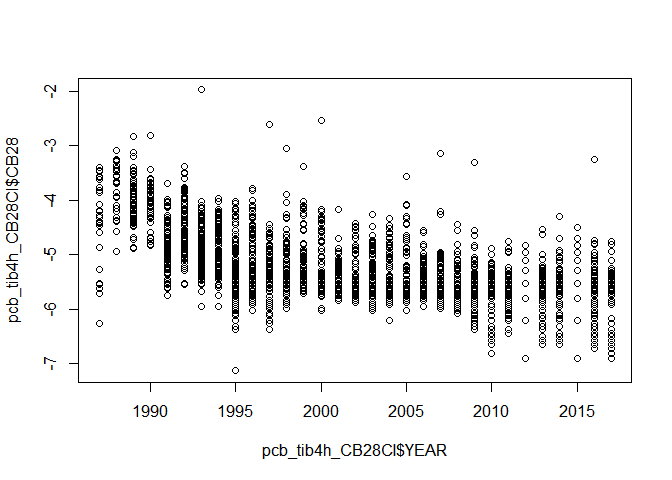<!-- -->

We will now use the methodology documented in “Cleaning the pcb dataset”
to substitute the CB28 censored values with values predicted by the
regression equation of the linear model `vB1_CB28_YEAR_fit` described
above.

We get Adjusted R-squared = 0.45, which is slightly higher than resulted
from the method of the previous section. However, this is as we expected
because substitution using predicted values has given plotted points
that lie on the regression line so the increase in R-squared is at the
expense of unrealistic alignment of the substituted points. See our
document “Preliminary studies of censored data” to see how such
alignment can be eliminated by the addition of noise.

    ## Warning in log(CB28): NaNs produced

    ## 
    ## Call:
    ## lm(formula = pcb_tib4h_CB28LMpredSUB1$CB28 ~ pcb_tib4h_CB28LMpredSUB1$YEAR)
    ## 
    ## Residuals:
    ##      Min       1Q   Median       3Q      Max 
    ## -2.25225 -0.14666 -0.00418  0.08290  2.80724 
    ## 
    ## Coefficients:
    ##                                Estimate Std. Error t value Pr(>|t|)    
    ## (Intercept)                   86.519626   1.934838   44.72   <2e-16 ***
    ## pcb_tib4h_CB28LMpredSUB1$YEAR -0.045814   0.000966  -47.42   <2e-16 ***
    ## ---
    ## Signif. codes:  0 '***' 0.001 '**' 0.01 '*' 0.05 '.' 0.1 ' ' 1
    ## 
    ## Residual standard error: 0.4304 on 2796 degrees of freedom
    ## Multiple R-squared:  0.4458, Adjusted R-squared:  0.4456 
    ## F-statistic:  2249 on 1 and 2796 DF,  p-value: < 2.2e-16

<!-- -->

We will now exclude the observations for which the value of CB28 is
censored and fit a linear model and compare with our previous results.
The resulting fitted model has coefficients (85.9, -0.045) and
Adjusted-R-squared = 0.180; these coefficients are then used to make
predictions, which are substituted and then the linear model is fit as
above. The resulting fitted model has coefficients (86.5, -0.046) and
Adjusted-R-squared = 0.45.

    ## 
    ## Call:
    ## lm(formula = pcb_tib4h_CB28lmEXCLUDE$CB28 ~ pcb_tib4h_CB28lmEXCLUDE$YEAR)
    ## 
    ## Residuals:
    ##      Min       1Q   Median       3Q      Max 
    ## -2.25388 -0.38816 -0.02621  0.36683  2.80625 
    ## 
    ## Coefficients:
    ##                               Estimate Std. Error t value Pr(>|t|)    
    ## (Intercept)                  85.885586   3.515171   24.43   <2e-16 ***
    ## pcb_tib4h_CB28lmEXCLUDE$YEAR -0.045495   0.001758  -25.87   <2e-16 ***
    ## ---
    ## Signif. codes:  0 '***' 0.001 '**' 0.01 '*' 0.05 '.' 0.1 ' ' 1
    ## 
    ## Residual standard error: 0.5632 on 1633 degrees of freedom
    ## Multiple R-squared:  0.2907, Adjusted R-squared:  0.2903 
    ## F-statistic: 669.4 on 1 and 1633 DF,  p-value: < 2.2e-16

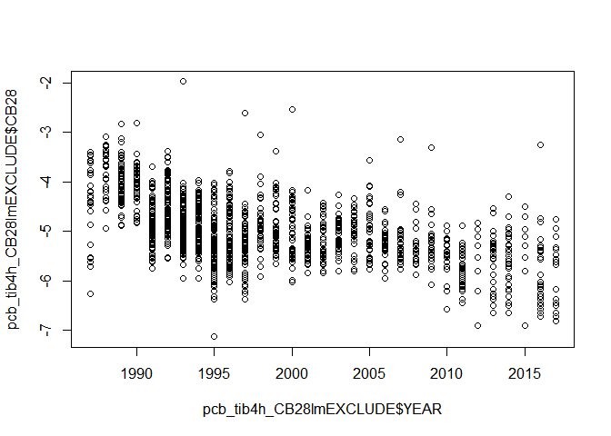<!-- -->

    ## Warning in log(CB28): NaNs produced

    ## 
    ## Call:
    ## lm(formula = pcb_tib4h_CB28lmEXCLUDE_predSUB$CB28 ~ pcb_tib4h_CB28lmEXCLUDE_predSUB$YEAR)
    ## 
    ## Residuals:
    ##      Min       1Q   Median       3Q      Max 
    ## -2.25225 -0.14666 -0.00418  0.08290  2.80724 
    ## 
    ## Coefficients:
    ##                                       Estimate Std. Error t value Pr(>|t|)    
    ## (Intercept)                          86.519626   1.934838   44.72   <2e-16 ***
    ## pcb_tib4h_CB28lmEXCLUDE_predSUB$YEAR -0.045814   0.000966  -47.42   <2e-16 ***
    ## ---
    ## Signif. codes:  0 '***' 0.001 '**' 0.01 '*' 0.05 '.' 0.1 ' ' 1
    ## 
    ## Residual standard error: 0.4304 on 2796 degrees of freedom
    ## Multiple R-squared:  0.4458, Adjusted R-squared:  0.4456 
    ## F-statistic:  2249 on 1 and 2796 DF,  p-value: < 2.2e-16

<!-- -->

In summary, three main approaches were tried: exclusion; substitution
using regression imputation; use of cenreg(). For each approach a model
was fitted, we will use the adjusted R-squared and likelihood-r values
to compare the goodness of fit for these models. The adjusted R-squared
values that resulted from models fitted by approaches 1a and 2A were
\(0.41\) and \(0.29\) respectively. The likelihood-r value obtained from
approach 3 was \(0.54\); since \(0.54^2=0.29\) we can say that the
models from approaches 2A and 3 fitted equally well, whereas the model
from approach 1a fit best of all.

The coefficients of the fitted cenreg() model were used to impute
missing values for CB28. A linear model was fit to the resulting
“completed” data set; the adjusted R-squared value for this model was
\(0.45\), which was the best fit of all the approaches we tried.

IS THIS STILL TRUE? The adjusted-R-squared values were reported for each
case and found to have similar values when exclusion and regression
imputation were used. However, for the cenreg() method, the value of
likelihood-r was reported and its squared value was found to be lower
than the adjusted R-squared values from the other approaches. Weaker
association after using cenreg() was not found in our document
“Preliminary studies of censored data”; our preliminary explanation is
to attribute this relative failure here to the larger proportion of
censored data for the CB28 variable than for the variables used in our
previous document. WAS IT EVER TRUE?

#### What effect (if any) does the use of annual (geometric) mean pcb concentrations have on our parameter estimates?

We will again use dataset `pcb_tib4h` as our starting point. The PCB
concentration data is incomplete for 1984, so we exclude this data from
1984, which results in 1987 being the first year. So we will remove all
observation prior to 1987 to create the reduced dataset
`pcb_tib4h_post87`, and we will set 1987 as “year zero”.

Since we are using the logarithms of the pcb concentrations we will use
the geometric means of these log-concentrations; for every year we
denote such a mean as the annual mean for that year. We will study the
effect of using such means by repeating the key parts of the above
approaches except that we will use the annual means instead of the
log-concentrations. We begin by displaying such data below.

### Scatter plots and linear model summaries for annual pcb concentrations after LOQ/sqrt(2) substitution

The scatter plots for CB28, CB52, CB138, CB153 respectively for this
approach are shown below.

    ## The following objects are masked from CB28_filtered4h:
    ## 
    ##     CB28, YEAR

    ## The following objects are masked from vB1h:
    ## 
    ##     CB101, CB118, CB138, CB153, CB180, CB28, CB52, YEAR

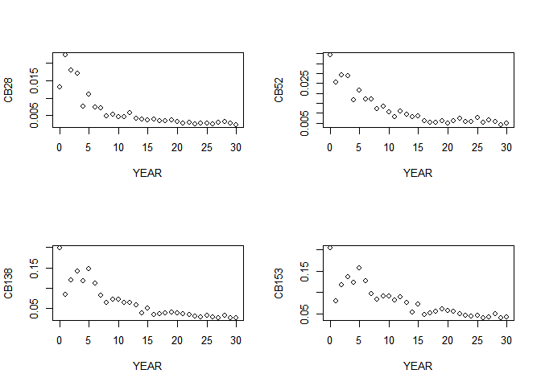<!-- -->

Summary output for fitted models for \(x=YEAR\),
\(y=CB28 or CB52 or CB138 or CB153\) for this approach are shown below.

    ## 
    ## Call:
    ## lm(formula = CB28 ~ YEAR)
    ## 
    ## Residuals:
    ##        Min         1Q     Median         3Q        Max 
    ## -0.0042062 -0.0023962 -0.0005592  0.0011109  0.0103069 
    ## 
    ## Coefficients:
    ##               Estimate Std. Error t value Pr(>|t|)    
    ## (Intercept)  1.242e-02  1.150e-03  10.803 1.11e-11 ***
    ## YEAR        -4.267e-04  6.583e-05  -6.482 4.29e-07 ***
    ## ---
    ## Signif. codes:  0 '***' 0.001 '**' 0.01 '*' 0.05 '.' 0.1 ' ' 1
    ## 
    ## Residual standard error: 0.003278 on 29 degrees of freedom
    ## Multiple R-squared:  0.5916, Adjusted R-squared:  0.5775 
    ## F-statistic: 42.01 on 1 and 29 DF,  p-value: 4.288e-07

    ## 
    ## Call:
    ## lm(formula = CB52 ~ YEAR)
    ## 
    ## Residuals:
    ##       Min        1Q    Median        3Q       Max 
    ## -0.006678 -0.004078 -0.001074  0.003169  0.015531 
    ## 
    ## Coefficients:
    ##               Estimate Std. Error t value Pr(>|t|)    
    ## (Intercept)  0.0236692  0.0017571  13.470 5.20e-14 ***
    ## YEAR        -0.0007992  0.0001006  -7.944 9.24e-09 ***
    ## ---
    ## Signif. codes:  0 '***' 0.001 '**' 0.01 '*' 0.05 '.' 0.1 ' ' 1
    ## 
    ## Residual standard error: 0.00501 on 29 degrees of freedom
    ## Multiple R-squared:  0.6851, Adjusted R-squared:  0.6743 
    ## F-statistic:  63.1 on 1 and 29 DF,  p-value: 9.243e-09

    ## 
    ## Call:
    ## lm(formula = CB138 ~ YEAR)
    ## 
    ## Residuals:
    ##       Min        1Q    Median        3Q       Max 
    ## -0.036831 -0.013691 -0.002616  0.010875  0.073658 
    ## 
    ## Coefficients:
    ##               Estimate Std. Error t value Pr(>|t|)    
    ## (Intercept)  0.1243421  0.0081792  15.202 2.38e-15 ***
    ## YEAR        -0.0040108  0.0004683  -8.564 1.96e-09 ***
    ## ---
    ## Signif. codes:  0 '***' 0.001 '**' 0.01 '*' 0.05 '.' 0.1 ' ' 1
    ## 
    ## Residual standard error: 0.02332 on 29 degrees of freedom
    ## Multiple R-squared:  0.7166, Adjusted R-squared:  0.7069 
    ## F-statistic: 73.34 on 1 and 29 DF,  p-value: 1.964e-09

    ## 
    ## Call:
    ## lm(formula = CB153 ~ YEAR)
    ## 
    ## Residuals:
    ##       Min        1Q    Median        3Q       Max 
    ## -0.048422 -0.009660 -0.001871  0.007003  0.071621 
    ## 
    ## Coefficients:
    ##               Estimate Std. Error t value Pr(>|t|)    
    ## (Intercept)  0.1323792  0.0076772  17.243  < 2e-16 ***
    ## YEAR        -0.0036569  0.0004396  -8.319  3.6e-09 ***
    ## ---
    ## Signif. codes:  0 '***' 0.001 '**' 0.01 '*' 0.05 '.' 0.1 ' ' 1
    ## 
    ## Residual standard error: 0.02189 on 29 degrees of freedom
    ## Multiple R-squared:  0.7047, Adjusted R-squared:  0.6945 
    ## F-statistic:  69.2 on 1 and 29 DF,  p-value: 3.6e-09

We see that the adjusted R-squared values are higher for the averaged
data than for the data itself.

#### Dataset creation, scatter plots and linear model summaries for pcb concentrations after exclusion of censored values

The scatter plots for CB28, CB52, CB138, CB153 respectively for this
approach are shown below.

    ## The following objects are masked from tib4h_year_sqrt2_sub (pos = 3):
    ## 
    ##     CB101, CB118, CB138, CB153, CB180, CB28, CB52, YEAR

    ## The following objects are masked from tib4h_year_sqrt2_sub (pos = 4):
    ## 
    ##     CB101, CB118, CB138, CB153, CB180, CB28, CB52, YEAR

    ## The following objects are masked from CB28_filtered4h:
    ## 
    ##     CB28, YEAR

    ## The following objects are masked from vB1h:
    ## 
    ##     CB101, CB118, CB138, CB153, CB180, CB28, CB52, YEAR

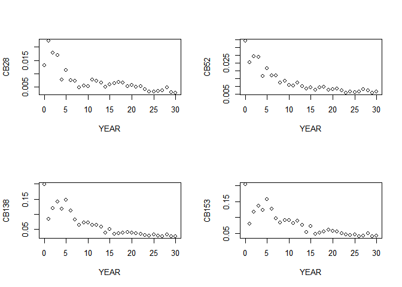<!-- -->

Summary output for fitted models for \(x=YEAR\), \(y=CBn\) where n
denotes 28, 52, 138, 153 respectively.

As before, we see that the adjusted R-squared values are higher for the
averaged data than for the data itself.

### Presentation of our chosen design

We obtained the values (-0.055, -0.046, 0.74, 0.92) for (beta\_cb28,
beta\_cb153, sd\_cb28, sd\_cb153) respectively. The values for
(beta\_cb153, sd\_cb153) will be held fixed at (-0.046, 0.92). The three
values for `beta_cb28` we will use in our simulations are (-0.04,
-0.055, -0.07); for `sd_cb28` we will use the values (0.50, 0.75, 1.00).

For `LOD` we will use values that correspond to proportions of censored
observations of 0.1, 0.3 and 0.5 respectively. These values correspond
to the CB28 values at the 10th, 30th and 50th percentiles respectively.

## Implementation of our simulation-based studies

### High-level description of our design

To be written.

### Studies in which `sd` is varied

To be written.

### Studies in which `beta` is varied

To be written.

### Studies in which `LOD` is varied

To be written.

## Evaluation of our results and comparison with SNMPC results

To be written.

## Summary

To be written.

## References, appendices etc

To be written.
