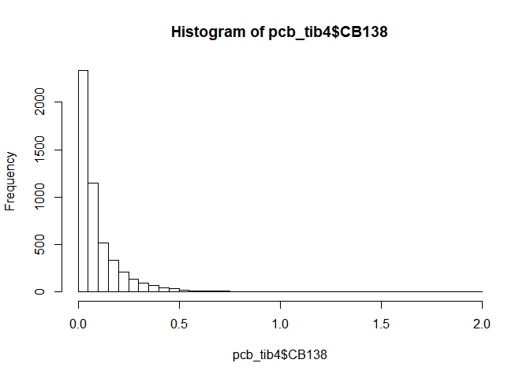
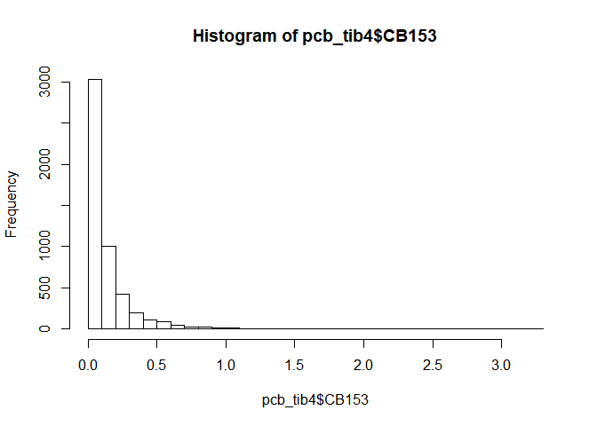
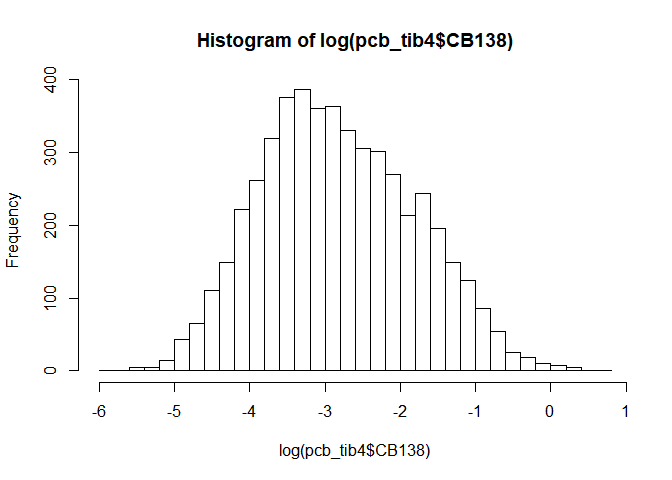
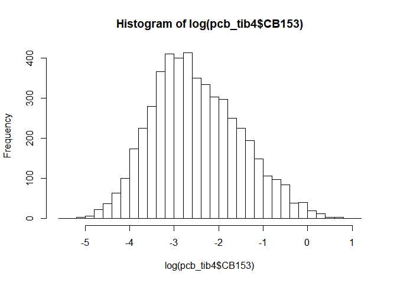
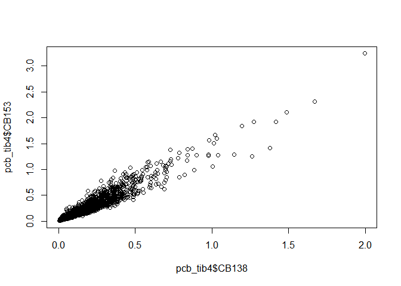
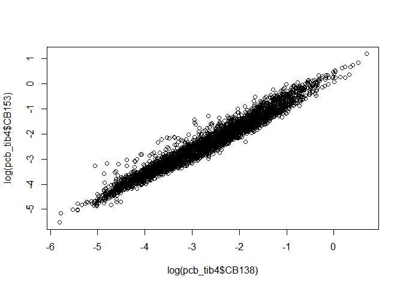
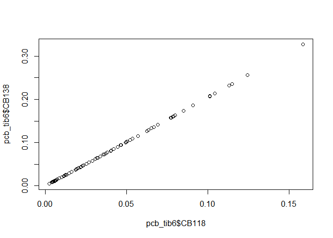

Cleaning the pcb dataset
================
Marc Roddis
2/9/2020

### Preliminary cleaning (creating pcb\_tib2)

By importing and viewing the given dataset `pcb.csv` we see that there
are 5056 observations of 18 variables. We begin by cleaning the dataset;
we first look for NA values; we see that some values are stated
explicitly as NA. Moreover, some values are stated as \(-99.99\),
\(-9.0000\) etc.; we interpret all such values as NA values. We
therefore replace all values that are less than \(-8\) with NA values,
in order to consistently denote all NA values as NA; we denote the
resulting tibble as `pcb_tib1`. We find that there are
\((298, 474, 138, 97, 6, 28, 30)\) NA values coded in this manner for
\((CB28, CB52, CB101, CB118, CB138, CB153, CB180)\), respectively.

From viewing `pcb_tib1` we see that all observations (with only one
exception) which have an NA value for CB153 also have NA values for all
variables except CB138. So as a matter of convenience we remove these
sparse observations, which results in `pcb_tib2`, which has 5028
observations. We find that there are \((271, 447, 111, 70, 0, 0, 3)\) NA
values coded in this manner for
\((CB28, CB52, CB101, CB118, CB138, CB153, CB180)\), respectively. We do
indeed see that did remove all observations that consisted almost
completely of NA values. We will use `pcb_tib2` are the starting point
for the remainder of our analysis.

#### Further cleaning (creating pcb\_tib3)

Starting from `pcb_tib2` we will now check the three observations for
CB180 that have NA values; we see that these observations have measured
values for at least five other PCB in each case. Checking for further NA
values, we now see that many values for CB28 are stated as either
\(0.0000\) or \(0\), which we will also interpret as NA values; let’s
see how many such values there are. Since `tib_CB28zero` has 360 rows,
we conclude that for CB28 there are 360 NA values that are encoded as
\(0.0000\) or \(0\).

Replacing all such encoded NA values with explicit NA values resulted in
`pcb_tib3`, which has \((631, 565, 125, 71, 0, 0, 44)\) NA values for
\((CB28, CB52, CB101, CB118, CB138, CB153, CB180)\), respectively.

The data `pcb_tib3$CB138` contains 11 negative values which each
represents a censored value. For every one of the 11 corresponding
observations the only uncensored value is for CB138, whereas the values
for the other 6 PCBs are given by one of two negative values, whereby
CB138 and CB180 have the same value as one another, and the four values
for CB28, CB52, CB101 and CB118 are equal to one another. So we choose
to remove these 11 sparse observations, which results in `pcb_tib4`,
which has 5017 observations. Our motivation is that `pcb_tib4` has no
censored values and no missing values for both CB138 and CB153; this
allows us to perform linear regression analysis much more
straightforwardly.

#### The distributions of CB138 and CB153

Let’s first show histograms of `pcb_tib4$CB138` and `pcb_tib4$CB153`; we
see that these distributions each have a large left-skew.

<!-- --><!-- -->

Histograms (not shown) of the logarithm (with bases: 2, \(e\), 10, 100
and 1000 respectively) of the CB153 data, showed that the shape of the
distribution does not change much when we change the base. We will
therefore use base \(e\) (as is standard practice) throughout the
remainder of this report. Histograms for \(log(CB138)\) and
\(log(CB153)\) are displayed below. We see that each of these
distributions still has some (but much less) left-skew and that each
loosely approximates the shape of a normal distribution. We will
therefore make the working assumption from now on that the data for each
of our seven PCBs of interest has a log-normal distribution.

<!-- --><!-- -->

#### Preliminary linear regression analysis

Since the data for CB153 was most complete in the original dataset
`pcb.csv` we will view CB153 as the predictor variable (denoted by x and
shown on the horizontal axis) throughout our analysis. We will use
“response variables” to denote the variables that we make predictions
for, “response variables” (denoted by y and shown on the vertical axis).
We first display a scatter plot for \(y=CB138\) versus \(x=CB153\); the
second scatter plot shows \(y=log(CB138)\) versus \(x=log(CB153)\).

<!-- --><!-- -->

The summary output for two fitted models corresponding to the two
previous scatter plots is displayed below. The output shows “Adjusted
R-squared: 0.9572” for the model with \(y=log(CB138)\) and
\(x=log(CB153)\), whereas “Adjusted R-squared: 0.931” for the model
without logarithms. We conclude that the correlation is stronger when
using the logarithms of the PCB concentrations. From now on, we will use
logarithm-transformed data throughout.

    ## 
    ## Call:
    ## lm(formula = pcb_tib4$CB153 ~ pcb_tib4$CB138)
    ## 
    ## Residuals:
    ##      Min       1Q   Median       3Q      Max 
    ## -0.50979 -0.01038  0.00156  0.00781  0.46675 
    ## 
    ## Coefficients:
    ##                  Estimate Std. Error t value Pr(>|t|)    
    ## (Intercept)    -0.0015025  0.0008962  -1.677   0.0937 .  
    ## pcb_tib4$CB138  1.3971395  0.0053689 260.227   <2e-16 ***
    ## ---
    ## Signif. codes:  0 '***' 0.001 '**' 0.01 '*' 0.05 '.' 0.1 ' ' 1
    ## 
    ## Residual standard error: 0.05023 on 5015 degrees of freedom
    ## Multiple R-squared:  0.931,  Adjusted R-squared:  0.931 
    ## F-statistic: 6.772e+04 on 1 and 5015 DF,  p-value: < 2.2e-16

    ## 
    ## Call:
    ## lm(formula = ylog ~ xlog)
    ## 
    ## Residuals:
    ##      Min       1Q   Median       3Q      Max 
    ## -0.73350 -0.12726  0.00109  0.10856  1.36636 
    ## 
    ## Coefficients:
    ##             Estimate Std. Error t value Pr(>|t|)    
    ## (Intercept) 0.204447   0.008559   23.89   <2e-16 ***
    ## xlog        0.957293   0.002857  335.05   <2e-16 ***
    ## ---
    ## Signif. codes:  0 '***' 0.001 '**' 0.01 '*' 0.05 '.' 0.1 ' ' 1
    ## 
    ## Residual standard error: 0.2059 on 5015 degrees of freedom
    ## Multiple R-squared:  0.9572, Adjusted R-squared:  0.9572 
    ## F-statistic: 1.123e+05 on 1 and 5015 DF,  p-value: < 2.2e-16

This preliminary regression analysis demonstrates the feasibility of our
approach: to use the fact that PCB concentrations are strongly
correlated to make predictions for censored values and for missing
values.

### Predicting concentrations of CB118 from CB138 and CB153

#### Model selection

For CB118 in `pcb_tib4`: the number of censored values is 25, and the
number of missing values is 71. We will first create `pcb_tib5` by
excluding observations for which CB118 is censored or missing. We will
then fit linear model for `pcb_tib5` with CB118 as response; CB138 and
CB153 are the two predictor variables, we will fit models for these
predictors separately, we will also fit a multiple linear regression
model using both predictors. We will then use this model to make
predictions for the missing and censored CB118 values.

    ## 
    ## Call:
    ## lm(formula = mod2_y ~ mod2_x1)
    ## 
    ## Residuals:
    ##      Min       1Q   Median       3Q      Max 
    ## -1.85288 -0.22225 -0.02485  0.19260  1.29699 
    ## 
    ## Coefficients:
    ##              Estimate Std. Error t value Pr(>|t|)    
    ## (Intercept) -1.090734   0.013705  -79.59   <2e-16 ***
    ## mod2_x1      0.972726   0.005113  190.26   <2e-16 ***
    ## ---
    ## Signif. codes:  0 '***' 0.001 '**' 0.01 '*' 0.05 '.' 0.1 ' ' 1
    ## 
    ## Residual standard error: 0.3567 on 4919 degrees of freedom
    ## Multiple R-squared:  0.8804, Adjusted R-squared:  0.8803 
    ## F-statistic: 3.62e+04 on 1 and 4919 DF,  p-value: < 2.2e-16

    ## 
    ## Call:
    ## lm(formula = mod2_y ~ mod2_x2)
    ## 
    ## Residuals:
    ##      Min       1Q   Median       3Q      Max 
    ## -2.02234 -0.13665 -0.00086  0.13909  1.08841 
    ## 
    ## Coefficients:
    ##              Estimate Std. Error t value Pr(>|t|)    
    ## (Intercept) -0.738955   0.010304  -71.72   <2e-16 ***
    ## mod2_x2      0.986010   0.003446  286.16   <2e-16 ***
    ## ---
    ## Signif. codes:  0 '***' 0.001 '**' 0.01 '*' 0.05 '.' 0.1 ' ' 1
    ## 
    ## Residual standard error: 0.2455 on 4919 degrees of freedom
    ## Multiple R-squared:  0.9433, Adjusted R-squared:  0.9433 
    ## F-statistic: 8.189e+04 on 1 and 4919 DF,  p-value: < 2.2e-16

    ## 
    ## Call:
    ## lm(formula = mod2_y ~ mod2_x1 * mod2_x2)
    ## 
    ## Residuals:
    ##      Min       1Q   Median       3Q      Max 
    ## -2.00556 -0.13060  0.00329  0.13811  1.01822 
    ## 
    ## Coefficients:
    ##                  Estimate Std. Error t value Pr(>|t|)    
    ## (Intercept)     -0.716848   0.018229 -39.325   <2e-16 ***
    ## mod2_x1         -0.298223   0.017242 -17.297   <2e-16 ***
    ## mod2_x2          1.238773   0.018233  67.941   <2e-16 ***
    ## mod2_x1:mod2_x2 -0.006705   0.002735  -2.452   0.0142 *  
    ## ---
    ## Signif. codes:  0 '***' 0.001 '**' 0.01 '*' 0.05 '.' 0.1 ' ' 1
    ## 
    ## Residual standard error: 0.2382 on 4917 degrees of freedom
    ## Multiple R-squared:  0.9467, Adjusted R-squared:  0.9466 
    ## F-statistic: 2.909e+04 on 3 and 4917 DF,  p-value: < 2.2e-16

    ## 
    ## Call:
    ## lm(formula = mod2_y ~ mod2_x1 + mod2_x2)
    ## 
    ## Residuals:
    ##      Min       1Q   Median       3Q      Max 
    ## -2.03294 -0.13069  0.00183  0.13971  1.02116 
    ## 
    ## Coefficients:
    ##             Estimate Std. Error t value Pr(>|t|)    
    ## (Intercept) -0.68040    0.01056  -64.45   <2e-16 ***
    ## mod2_x1     -0.28566    0.01647  -17.34   <2e-16 ***
    ## mod2_x2      1.25966    0.01613   78.10   <2e-16 ***
    ## ---
    ## Signif. codes:  0 '***' 0.001 '**' 0.01 '*' 0.05 '.' 0.1 ' ' 1
    ## 
    ## Residual standard error: 0.2383 on 4918 degrees of freedom
    ## Multiple R-squared:  0.9466, Adjusted R-squared:  0.9466 
    ## F-statistic: 4.359e+04 on 2 and 4918 DF,  p-value: < 2.2e-16

From the summary output data above, we select `lin_mod2x2` for
predicting CB118 values because it has the largest values for the t- and
F-statistics and it also has only one predictor variable so it is easier
to work with.

#### Predictions for CB118 using `lin_mod2x2`

Our first attempt to predict missing and censored values of CB118 by
linear regression is assigned to `pcb_tib6` (glimpsed below).

We see below that there is perfect correlation (as should be the case)
between pcb\_tib6\(CB118 and pcb_tib6\)CB138.

    ## Observations: 96
    ## Variables: 18
    ## $ ACCNR   <chr> "P84/03612", "P84/03613", "P84/03614", "P84/03615", "P84/03...
    ## $ YEAR    <dbl> 1984, 1984, 1984, 1984, 1984, 1984, 1984, 1984, 1984, 1984,...
    ## $ SPECIES <chr> "Perch", "Perch", "Perch", "Perch", "Perch", "Perch", "Perc...
    ## $ LOC     <chr> "Kvädöfjärden", "Kvädöfjärden", "Kvädöfjärden", "Kvädöfjärd...
    ## $ LAT     <dbl> 58.03364, 58.03364, 58.03364, 58.03364, 58.03364, 58.03364,...
    ## $ LONG    <dbl> 16.76497, 16.76497, 16.76497, 16.76497, 16.76497, 16.76497,...
    ## $ NHOM    <dbl> NA, NA, NA, NA, NA, NA, NA, NA, NA, NA, NA, NA, NA, NA, NA,...
    ## $ ALDR    <dbl> 3, 4, 6, 4, 4, 3, 4, 4, 4, 4, 4, 5, 5, 4, 4, 5, 5, 5, 4, 4,...
    ## $ TOTL    <dbl> 16.6, 16.0, 17.6, 15.8, 15.7, 16.5, 18.6, 18.3, 16.4, 16.2,...
    ## $ TOTV    <dbl> 52.8, 50.8, 71.3, 45.2, 51.9, 53.4, 86.1, 79.5, 49.4, 49.1,...
    ## $ FPRC    <dbl> 0.80, 0.69, 0.78, 0.78, 0.63, 0.75, 0.66, 0.66, 0.71, 0.72,...
    ## $ CB28    <dbl> 0.007, 0.007, 0.005, 0.007, 0.007, 0.008, 0.004, 0.007, 0.0...
    ## $ CB52    <dbl> NA, NA, NA, NA, NA, NA, NA, NA, NA, NA, NA, NA, NA, NA, NA,...
    ## $ CB101   <dbl> 0.027, 0.084, 0.022, 0.037, 0.024, 0.049, 0.013, 0.038, 0.0...
    ## $ CB118   <dbl> 0.0624, 0.0784, 0.0323, 0.0464, 0.0420, 0.0537, 0.0229, 0.0...
    ## $ CB153   <dbl> 0.1790, 0.2230, 0.0980, 0.1480, 0.1320, 0.1520, 0.0680, 0.1...
    ## $ CB138   <dbl> 0.1270, 0.1600, 0.0650, 0.0940, 0.0850, 0.1090, 0.0460, 0.1...
    ## $ CB180   <dbl> 0.0610, 0.0540, 0.0230, 0.0210, 0.0360, 0.0220, 0.0140, 0.0...

<!-- -->

    ## 
    ## Call:
    ## lm(formula = pcb_tib6$CB118 ~ pcb_tib6$CB138)
    ## 
    ## Residuals:
    ##        Min         1Q     Median         3Q        Max 
    ## -9.454e-04 -1.934e-04  6.424e-05  1.722e-04  2.528e-04 
    ## 
    ## Coefficients:
    ##                 Estimate Std. Error t value Pr(>|t|)    
    ## (Intercept)    4.445e-04  3.208e-05   13.86   <2e-16 ***
    ## pcb_tib6$CB138 4.867e-01  3.188e-04 1526.49   <2e-16 ***
    ## ---
    ## Signif. codes:  0 '***' 0.001 '**' 0.01 '*' 0.05 '.' 0.1 ' ' 1
    ## 
    ## Residual standard error: 0.0002104 on 94 degrees of freedom
    ## Multiple R-squared:      1,  Adjusted R-squared:      1 
    ## F-statistic: 2.33e+06 on 1 and 94 DF,  p-value: < 2.2e-16

Our next step is to replace the values from `pcb_tib4` with these
values. I must now learn how to do this :)
