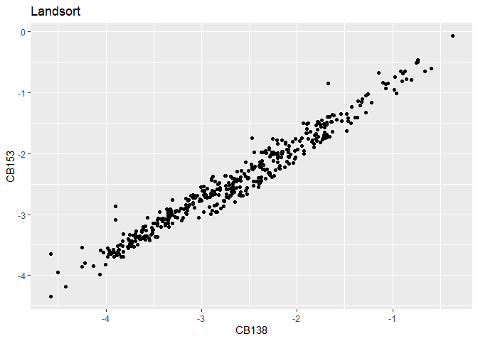
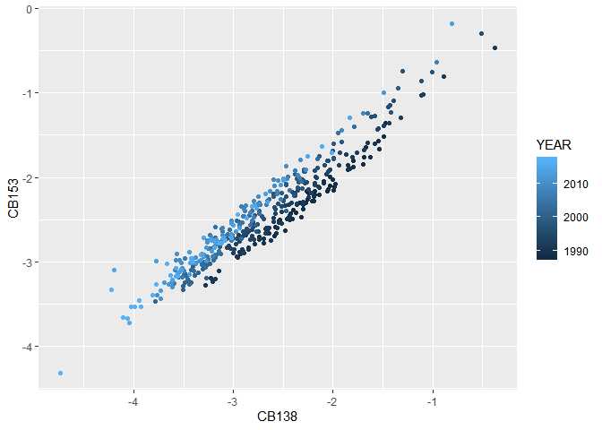

Exploratory data analysis looking for evidence of confounding
================
Marc Roddis
2/13/2020

### Exploratory data analysis looking for evidence of confounding

We begin with `pcb_tib4` which was created as described in my document
“Cleaning the pcb dataset”. We will first mutate `pcb_tib4` (and
denote this mutated tibble as `pcb_tib4m`) so that it contains the
logarithms of the concentrations of CB138 and CB153 instead of the
concentrations themselves. In this document we will produce explore the
effect of various variables on the appearance of the scatter plot, and
also on the Adjusted R-squared and slope coefficient for a fitted linear
model in each case. We begin by looking at the effect of location `LOC`
followed by `SPECIES`, age `ALDR`, `YEAR`, percentage fat `FPRC`.
Throughout this document, we use y = CB153 and x = CB138 (note: x and y
are in the opposite sense here to their sense in “Cleaning the pcb
dataset”).

Our first plot displays all 5017 observations from `pcb_tib4m`.

<!-- -->

### Exploring the variable location `LOC`

We first get an overview by showing a scatter plot of all observations,
colour coded by location (this is a colour coded version of the previous
plot). We see that there are too many locations (27, to be precise) to
display clearly in a single plot.

<!-- -->

We will now create sub-tibbles by filtering by location, and display the
corresponding scatter plot from each. The plots below each show all of
the observations from a single location.

<!-- --><!-- --><!-- --><!-- --><!-- --><!-- --><!-- --><!-- --><!-- -->

We will now join the tibble for location “Ängskärsklubb” with the other
“one-location-tibbles” to produce tibbles and corresponding scatter
plots for “Ängskärsklubb” paired with one other location. A total of 19
scatter plots were generated and viewed; these plots showed overlays of
different combinations of the locations shown above. These 19 plots are
omitted, they did not show any additional features of interest that are
not shown in the above plots.

We will now join the tibble for location “Fladen” with the other
“one-location-tibbles” to produce tibbles and corresponding scatter
plots for “Fladen” paired with one other location.

We now create tibbles and corresponding scatter plots that each cover
three or more locations.

### Exploring the variable `SPECIES`

We will now choose one of these locations and display plots grouped by
species. We begin by choosing “Fladen” because its scatter plot has a
curious disjointed appearance. The scatter plot below shows distinct
clustering according to species. This strongly suggests that species
could be a confounding variable with respect to the association between
CB138 and CB153.

<!-- -->

We will now get an overview (with regard to species) by showing a
scatter plot of all 5017 observations from `pcb_tib4m`, colour coded by
species (this is a colour coded version of the first scatter plot in
this document).

<!-- -->

We will now create sub-tibbles by filtering by species, and display the
corresponding scatter plot from each. The plots below each show all of
the observations from a single species.

<!-- --><!-- --><!-- --><!-- --><!-- -->

### Fitting linear models for these sub-tibbles

We will now fit a linear model for y=CB153 and x=CB138 in the same way
we did in our earlier document “Cleaning the pcb dataset”, except that
we will only use observations from SPECIES=“Herring” this time. We
conjecture that species is a confounding variable and that we will could
obtain a higher R-squared value by accounting for this. Our conjecture
is validated by the model summary output below which shows the higher
value: “Adjusted R-squared: 0.9713”.

    ## 
    ## Call:
    ## lm(formula = pcb_tib4m_herring$CB153 ~ pcb_tib4m_herring$CB138)
    ## 
    ## Residuals:
    ##      Min       1Q   Median       3Q      Max 
    ## -0.62506 -0.10416  0.01615  0.10821  0.89820 
    ## 
    ## Coefficients:
    ##                         Estimate Std. Error t value Pr(>|t|)    
    ## (Intercept)             0.038315   0.008472   4.523 6.32e-06 ***
    ## pcb_tib4m_herring$CB138 0.926430   0.002783 332.851  < 2e-16 ***
    ## ---
    ## Signif. codes:  0 '***' 0.001 '**' 0.01 '*' 0.05 '.' 0.1 ' ' 1
    ## 
    ## Residual standard error: 0.1562 on 3267 degrees of freedom
    ## Multiple R-squared:  0.9714, Adjusted R-squared:  0.9713 
    ## F-statistic: 1.108e+05 on 1 and 3267 DF,  p-value: < 2.2e-16

We now repeat this process by fitting corresponding linear models for
the other four species. The adjusted R-squared values are (0.911, 0.933,
0.940, 0.971, 0.964) and the slope coefficients are (0.926, 0.904,
1.061, 0.844, 0.892) for (Blue mussel, Cod, Eelpout, Herring, Perch)
respectively.

We will continue our search for confounders using `pcb_tib4m_herring` as
our starting point; let’s begin with an overview of this whole dataset
grouped by location. There are observations from herring from 22
locations, which is too many to view clearly, so let’s filter by the
same locations we looked at earlier. Of these, there are six locations
that each have over 30 observations for herring. Scatter plots for these
locations were viewed (not shown in this document), and a linear model
was fitted for each. The adjusted R-squared values are (0.956, 0.953,
0.960, 0.915, 0.953, 0.950) and the slope coefficients are (0.875,
0.831, 0.914, 0.868, 0.831, 0.948) for (Ängskärsklubb, Fladen, Landsort,
Utlängan, Utlängan (spring), Väderöarna) respectively. The R-squared
values are all within the interval \[0.95, 0.96\] except for Utlängan
(0.915), the scatter plot for Utlängan does not show any unusual
patterns, so we will exclude Utlängan from further study.

We will now proceed with data for herring from Landsort by first
displaying a scatter plot grouped by age `ALDR`. No confounding or
clustering by age can be discerned from this plot, Two linear models
were then fitted: one for the 169 fish aged 2-3 and one for the 254 fish
aged 5-7. The adjusted R-squared values are (0.894, 0.922) and the slope
coefficients are (0.893, 0.859) for (2-3 years old, 4-7 years old)
respectively; these values are quite similar so we will not view `ALDR`
as a confounding variable at this stage so we will not filter by `ALDR`.

We will now explore grouping by `YEAR`. The scatter plot shown below is
grouped by `YEAR` and shows distinct clustering, so we will next explore
filtering by `YEAR`.

<!-- -->

We will begin by fitting two linear models: one for the 208 observations
from the 20th century and one for the 215 observations from the 21st
century. The adjusted R-squared values are (0.928, 0.954) and the slope
coefficients are (0.993, 0.997) for (20th century, 21st century)
respectively. The slope coefficients are remarkably similar for the two
centuries, so we will not filter by `YEAR`.

We will now explore whether we should filter by fat percentage `FPRC`.
The adjusted R-squared values are (0.956, 0.929, 0.931, 0.967) and the
slope coefficients are (0.879, 0.815, 0.763, 0.964) for fat percentages
that are (LOW, MEDIUM, HIGH, VHIGH) respectively. Although these slope
coefficients do show some variation, these values decrease then
increase, so there is no clear pattern. Moreover the adjusted R-squared
values are all in the fairly narrow interval \[0.929, 0.967\], so there
is no clear evidence for filtering the dataset by `FPRC` so we will not
do this.

In summary, we explored possible confounding variables and concluded
that we should filter by `SPECIES` because the scatter plot for herring
from Fladen showed distinct clusters for “Cod” and “Herring”. A
conclusion supported by weaker evidence is that we should also filter by
location `LOC`; the scatter plots for different locations did show some
differences of appearance, however, linear models for different
locations were not fitted so this evidence is weaker than for `SPECIES`.
