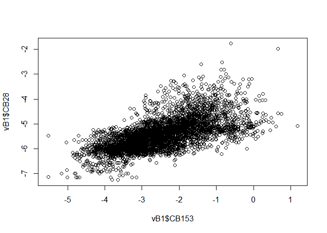
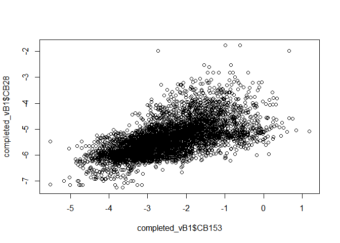

Imputation based on van Buurens book First Attempt
================
Marc Roddis
2/26/2020

### Creation of the dataset `vB1` to do imputations on

We create `pcb_tib1`, `pcb_tib2`, and `pcb_tib3` using the same code as
we used in “Preliminary studies of censored data”. We then create the
tibble `vB1`, which will serve as the starting point for our imputation
studies based upon the first edition of Van Buuren’s book “Flexible
Imputation of Missing Data”; this tibble `vB1` has all missing values
coded as “NA”, all censored values C substituted with abs(C)/sqrt(2),
and all concentrations substituted with their log-values. We will begin
by reproducing basic approaches from Chapter 1.

The most basic approach is to use `na.action = na.omit` in `lm()` to
perform listwise deletion. A drawback of this approach is loss of
information, for example we get “631 observations deleted due to
missingness” for `CB28 ~ CB153` or 954 deleted for `CB28 ~ CB52`. “If
the data are MCAR, listwise deletion produces unbiased estimates of
means, variances and regression weights. Under MCAR, listwise deletion
produces standard errors and significance levels that are correct for
the reduced subset of data, but that are often larger relative to all
available data. A disadvantage of listwise deletion is that it is
potentially wasteful. \[…\] If the data are not MCAR, listwise deletion
can severely bias estimates of means, regression coefficients and
correlations.” However, “There are cases in which listwise deletion can
provide better estimates than even the most sophisticated procedures.”
(see Section 2.6). Moreover, “Little and Rubin (2002) argue that it is
difficult to formulate rules of thumb since the consequences of using
listwise deletion depend on more than the missing data rate alone.”

#### Unsuitable methods

We will not use pairwise deletion since it is not generally applicable
and falls outside the scope of this study, “Pairwise deletion should
only be used if the procedure that follows it is specifically designed
to take deletion into account.” We will instead focus on using various
functions from the `mice` package for performing imputation in various
ways.

We will not use mean imputation since “Mean imputation is a fast and
simple fix for the missing data. However, it will underestimate the
variance, disturb the relations between variables, bias almost any
estimate other than the mean and bias the estimate of the mean when data
are not MCAR. Mean imputation should perhaps only be used as a rapid fix
when a handful of values are missing, and it should be avoided in
general.”

Regression imputation was used in our earlier report “Preliminary
studies of censored data”. However, the scatter plots showed that the
imputed data lay perfectly on the regression line. Ad hoc addition of
noise gave realistic looking scatter plots, however this report aims to
use theory-based rather than ad hoc approaches whenever possible, so we
will not explore regression imputation any further in this report.

The mice package allows us to perform theory based “Stochastic
regression imputation” (see Section 3.2), which is a potential areas for
further study later in this report. However, this method also has the
clear drawback that it can generate implausible values such as negative
values.

Based on what we have learnt so far, we view the other methods given by
van Buuren on page 16 as outside the scope of our study. We will instead
focus our attention on van Buuren’s recommendation “Multiple
imputation”. Our first attempt fails to run.

#### Multiple imputation (MI) using the `mice` algorithm

For our second attempt at MI, we first the `quickpred()` function (see
vB page 128 for the methodology used by `quickpred()`) and then perform
multiple imputation using `mice()` and fill in the missing values with
`complete()`. The output below first compares CB28 from `vB1` (which has
631 missing values) with CB28 from `completed_vB1` (which has no missing
values). Then linear models with all significant predictors are fitted
for each PCB concentration from the `completed_vB1` dataset. There are
approximately 10 significant predictors for the fitted model for each
PCB concentration. Although trends in PCB concentration with time have
been the main focus of reports based on datasets similar to this one,
`YEAR` is not even significant for every PCB.

<!-- --><!-- -->

    ## 
    ## Call:
    ## lm(formula = CB28 ~ CB153, data = vB1, na.action = na.omit)
    ## 
    ## Residuals:
    ##      Min       1Q   Median       3Q      Max 
    ## -1.49578 -0.30894 -0.02625  0.25060  2.90289 
    ## 
    ## Coefficients:
    ##              Estimate Std. Error t value Pr(>|t|)    
    ## (Intercept) -4.432866   0.019261 -230.14   <2e-16 ***
    ## CB153        0.399292   0.007122   56.07   <2e-16 ***
    ## ---
    ## Signif. codes:  0 '***' 0.001 '**' 0.01 '*' 0.05 '.' 0.1 ' ' 1
    ## 
    ## Residual standard error: 0.4801 on 4395 degrees of freedom
    ##   (631 observations deleted due to missingness)
    ## Multiple R-squared:  0.417,  Adjusted R-squared:  0.4169 
    ## F-statistic:  3144 on 1 and 4395 DF,  p-value: < 2.2e-16

    ## 
    ## Call:
    ## lm(formula = CB28 ~ CB153, data = completed_vB1)
    ## 
    ## Residuals:
    ##     Min      1Q  Median      3Q     Max 
    ## -1.6464 -0.3286 -0.0375  0.2592  3.5076 
    ## 
    ## Coefficients:
    ##              Estimate Std. Error t value Pr(>|t|)    
    ## (Intercept) -4.362738   0.019484 -223.91   <2e-16 ***
    ## CB153        0.410996   0.007246   56.72   <2e-16 ***
    ## ---
    ## Signif. codes:  0 '***' 0.001 '**' 0.01 '*' 0.05 '.' 0.1 ' ' 1
    ## 
    ## Residual standard error: 0.5129 on 5026 degrees of freedom
    ## Multiple R-squared:  0.3903, Adjusted R-squared:  0.3902 
    ## F-statistic:  3217 on 1 and 5026 DF,  p-value: < 2.2e-16

    ## 
    ## Call:
    ## lm(formula = CB28 ~ YEAR + LAT + LONG + ALDR + TOTV + FPRC + 
    ##     CB52 + CB101 + CB118 + CB138 + CB153 + CB180, data = completed_vB1)
    ## 
    ## Residuals:
    ##      Min       1Q   Median       3Q      Max 
    ## -2.06733 -0.20149  0.01564  0.20009  2.72374 
    ## 
    ## Coefficients:
    ##               Estimate Std. Error t value Pr(>|t|)    
    ## (Intercept)  2.219e+01  1.517e+00  14.629  < 2e-16 ***
    ## YEAR        -1.157e-02  7.610e-04 -15.200  < 2e-16 ***
    ## LAT         -2.976e-02  2.718e-03 -10.950  < 2e-16 ***
    ## LONG         1.495e-02  2.441e-03   6.125 9.73e-10 ***
    ## ALDR        -1.841e-02  1.670e-03 -11.023  < 2e-16 ***
    ## TOTV         4.613e-04  6.923e-05   6.663 2.98e-11 ***
    ## FPRC        -7.227e-03  6.913e-04 -10.455  < 2e-16 ***
    ## CB52         3.577e-01  1.097e-02  32.597  < 2e-16 ***
    ## CB101       -8.685e-02  1.210e-02  -7.179 8.06e-13 ***
    ## CB118        5.462e-01  2.210e-02  24.714  < 2e-16 ***
    ## CB138       -3.933e-01  4.243e-02  -9.268  < 2e-16 ***
    ## CB153       -1.778e-01  3.449e-02  -5.154 2.64e-07 ***
    ## CB180        2.722e-01  1.696e-02  16.048  < 2e-16 ***
    ## ---
    ## Signif. codes:  0 '***' 0.001 '**' 0.01 '*' 0.05 '.' 0.1 ' ' 1
    ## 
    ## Residual standard error: 0.3303 on 5015 degrees of freedom
    ## Multiple R-squared:  0.7477, Adjusted R-squared:  0.7471 
    ## F-statistic:  1238 on 12 and 5015 DF,  p-value: < 2.2e-16

    ## 
    ## Call:
    ## lm(formula = CB52 ~ YEAR + LONG + ALDR + TOTV + FPRC + CB28 + 
    ##     CB101 + CB118 + CB138 + CB153 + CB180, data = completed_vB1)
    ## 
    ## Residuals:
    ##     Min      1Q  Median      3Q     Max 
    ## -2.3773 -0.2096  0.0261  0.1951  3.4091 
    ## 
    ## Coefficients:
    ##               Estimate Std. Error t value Pr(>|t|)    
    ## (Intercept)  4.096e+00  1.790e+00   2.289  0.02214 *  
    ## YEAR        -2.065e-03  9.073e-04  -2.276  0.02288 *  
    ## LONG        -1.655e-02  2.252e-03  -7.348 2.34e-13 ***
    ## ALDR         3.351e-02  1.904e-03  17.599  < 2e-16 ***
    ## TOTV        -4.773e-04  8.084e-05  -5.904 3.78e-09 ***
    ## FPRC         2.284e-03  7.998e-04   2.856  0.00431 ** 
    ## CB28         4.926e-01  1.476e-02  33.386  < 2e-16 ***
    ## CB101        5.386e-01  1.159e-02  46.468  < 2e-16 ***
    ## CB118        2.875e-01  2.706e-02  10.623  < 2e-16 ***
    ## CB138       -1.963e-01  4.950e-02  -3.965 7.45e-05 ***
    ## CB153       -1.214e-01  3.967e-02  -3.061  0.00222 ** 
    ## CB180       -5.613e-02  2.011e-02  -2.790  0.00529 ** 
    ## ---
    ## Signif. codes:  0 '***' 0.001 '**' 0.01 '*' 0.05 '.' 0.1 ' ' 1
    ## 
    ## Residual standard error: 0.3861 on 5016 degrees of freedom
    ## Multiple R-squared:  0.8056, Adjusted R-squared:  0.8052 
    ## F-statistic:  1890 on 11 and 5016 DF,  p-value: < 2.2e-16

    ## 
    ## Call:
    ## lm(formula = CB101 ~ YEAR + LAT + LONG + ALDR + FPRC + CB52 + 
    ##     CB28 + CB118 + CB138 + CB153 + CB180, data = completed_vB1)
    ## 
    ## Residuals:
    ##     Min      1Q  Median      3Q     Max 
    ## -2.5861 -0.1431  0.0418  0.2110  2.1428 
    ## 
    ## Coefficients:
    ##               Estimate Std. Error t value Pr(>|t|)    
    ## (Intercept) -1.387e+01  1.780e+00  -7.789 8.15e-15 ***
    ## YEAR         8.008e-03  8.929e-04   8.969  < 2e-16 ***
    ## LAT         -5.018e-02  3.107e-03 -16.152  < 2e-16 ***
    ## LONG         5.267e-02  2.731e-03  19.288  < 2e-16 ***
    ## ALDR        -3.699e-02  1.891e-03 -19.561  < 2e-16 ***
    ## FPRC         1.782e-03  4.488e-04   3.971 7.25e-05 ***
    ## CB52         5.273e-01  1.183e-02  44.559  < 2e-16 ***
    ## CB28        -1.178e-01  1.624e-02  -7.253 4.70e-13 ***
    ## CB118       -7.376e-02  2.713e-02  -2.719 0.006566 ** 
    ## CB138        1.593e+00  4.429e-02  35.973  < 2e-16 ***
    ## CB153       -1.103e+00  3.658e-02 -30.165  < 2e-16 ***
    ## CB180        7.339e-02  2.012e-02   3.647 0.000268 ***
    ## ---
    ## Signif. codes:  0 '***' 0.001 '**' 0.01 '*' 0.05 '.' 0.1 ' ' 1
    ## 
    ## Residual standard error: 0.3835 on 5016 degrees of freedom
    ## Multiple R-squared:  0.8519, Adjusted R-squared:  0.8515 
    ## F-statistic:  2622 on 11 and 5016 DF,  p-value: < 2.2e-16

    ## 
    ## Call:
    ## lm(formula = CB118 ~ ALDR + TOTV + FPRC + CB52 + CB101 + CB28 + 
    ##     CB138 + CB153 + CB180, data = completed_vB1)
    ## 
    ## Residuals:
    ##      Min       1Q   Median       3Q      Max 
    ## -1.54012 -0.11630 -0.00082  0.11635  0.86588 
    ## 
    ## Coefficients:
    ##               Estimate Std. Error t value Pr(>|t|)    
    ## (Intercept)  6.819e-02  2.814e-02   2.424 0.015401 *  
    ## ALDR         1.066e-02  9.997e-04  10.668  < 2e-16 ***
    ## TOTV        -1.567e-04  4.153e-05  -3.774 0.000163 ***
    ## FPRC         3.648e-03  4.088e-04   8.924  < 2e-16 ***
    ## CB52         7.684e-02  7.162e-03  10.729  < 2e-16 ***
    ## CB101       -2.052e-02  6.972e-03  -2.944 0.003259 ** 
    ## CB28         2.029e-01  7.731e-03  26.244  < 2e-16 ***
    ## CB138        9.586e-01  1.935e-02  49.530  < 2e-16 ***
    ## CB153        8.600e-02  1.822e-02   4.720 2.42e-06 ***
    ## CB180       -1.725e-01  7.522e-03 -22.936  < 2e-16 ***
    ## ---
    ## Signif. codes:  0 '***' 0.001 '**' 0.01 '*' 0.05 '.' 0.1 ' ' 1
    ## 
    ## Residual standard error: 0.1993 on 5018 degrees of freedom
    ## Multiple R-squared:  0.9631, Adjusted R-squared:  0.963 
    ## F-statistic: 1.456e+04 on 9 and 5018 DF,  p-value: < 2.2e-16

    ## 
    ## Call:
    ## lm(formula = CB138 ~ YEAR + LAT + LONG + ALDR + CB52 + CB101 + 
    ##     CB118 + CB28 + CB153 + CB180, data = completed_vB1)
    ## 
    ## Residuals:
    ##      Min       1Q   Median       3Q      Max 
    ## -0.95889 -0.05360  0.00229  0.06019  0.48741 
    ## 
    ## Coefficients:
    ##               Estimate Std. Error t value Pr(>|t|)    
    ## (Intercept) 12.4753717  0.4780030  26.099  < 2e-16 ***
    ## YEAR        -0.0063736  0.0002394 -26.618  < 2e-16 ***
    ## LAT          0.0093239  0.0008645  10.785  < 2e-16 ***
    ## LONG        -0.0108291  0.0007800 -13.883  < 2e-16 ***
    ## ALDR        -0.0026287  0.0005570  -4.720 2.43e-06 ***
    ## CB52        -0.0136282  0.0039664  -3.436 0.000595 ***
    ## CB101        0.1282400  0.0035793  35.828  < 2e-16 ***
    ## CB118        0.2802145  0.0065443  42.818  < 2e-16 ***
    ## CB28        -0.0415751  0.0045716  -9.094  < 2e-16 ***
    ## CB153        0.5595378  0.0080966  69.108  < 2e-16 ***
    ## CB180        0.0847631  0.0056060  15.120  < 2e-16 ***
    ## ---
    ## Signif. codes:  0 '***' 0.001 '**' 0.01 '*' 0.05 '.' 0.1 ' ' 1
    ## 
    ## Residual standard error: 0.1091 on 5017 degrees of freedom
    ## Multiple R-squared:  0.9886, Adjusted R-squared:  0.9886 
    ## F-statistic: 4.361e+04 on 10 and 5017 DF,  p-value: < 2.2e-16

    ## 
    ## Call:
    ## lm(formula = CB153 ~ YEAR + LAT + LONG + ALDR + TOTV + FPRC + 
    ##     CB52 + CB101 + CB118 + CB138 + CB28 + CB180, data = completed_vB1)
    ## 
    ## Residuals:
    ##      Min       1Q   Median       3Q      Max 
    ## -0.89679 -0.08168 -0.00489  0.07495  1.06368 
    ## 
    ## Coefficients:
    ##               Estimate Std. Error t value Pr(>|t|)    
    ## (Intercept) -1.661e+01  5.874e-01 -28.277  < 2e-16 ***
    ## YEAR         8.822e-03  2.924e-04  30.174  < 2e-16 ***
    ## LAT         -1.493e-02  1.103e-03 -13.537  < 2e-16 ***
    ## LONG        -2.950e-03  9.995e-04  -2.952  0.00317 ** 
    ## ALDR        -8.385e-03  6.798e-04 -12.334  < 2e-16 ***
    ## TOTV         2.826e-04  2.811e-05  10.051  < 2e-16 ***
    ## FPRC        -2.343e-03  2.834e-04  -8.269  < 2e-16 ***
    ## CB52        -1.617e-02  4.928e-03  -3.282  0.00104 ** 
    ## CB101       -1.361e-01  4.578e-03 -29.731  < 2e-16 ***
    ## CB118        4.553e-02  9.536e-03   4.774 1.85e-06 ***
    ## CB138        8.579e-01  1.259e-02  68.137  < 2e-16 ***
    ## CB28        -2.964e-02  5.751e-03  -5.154 2.64e-07 ***
    ## CB180        1.949e-01  6.545e-03  29.773  < 2e-16 ***
    ## ---
    ## Signif. codes:  0 '***' 0.001 '**' 0.01 '*' 0.05 '.' 0.1 ' ' 1
    ## 
    ## Residual standard error: 0.1349 on 5015 degrees of freedom
    ## Multiple R-squared:  0.9818, Adjusted R-squared:  0.9817 
    ## F-statistic: 2.253e+04 on 12 and 5015 DF,  p-value: < 2.2e-16

    ## 
    ## Call:
    ## lm(formula = CB180 ~ LAT + LONG + ALDR + TOTV + FPRC + CB52 + 
    ##     CB101 + CB118 + CB138 + CB153 + CB28, data = completed_vB1)
    ## 
    ## Residuals:
    ##      Min       1Q   Median       3Q      Max 
    ## -1.35323 -0.15428 -0.01003  0.14468  1.69060 
    ## 
    ## Coefficients:
    ##               Estimate Std. Error t value Pr(>|t|)    
    ## (Intercept) -3.070e+00  1.063e-01 -28.877  < 2e-16 ***
    ## LAT          2.216e-02  2.206e-03  10.042  < 2e-16 ***
    ## LONG         5.943e-02  1.799e-03  33.030  < 2e-16 ***
    ## ALDR         4.321e-02  1.228e-03  35.185  < 2e-16 ***
    ## TOTV        -2.669e-04  5.612e-05  -4.755 2.04e-06 ***
    ## FPRC         2.465e-03  5.658e-04   4.357 1.35e-05 ***
    ## CB52        -2.462e-02  9.800e-03  -2.512 0.012040 *  
    ## CB101        3.382e-02  9.787e-03   3.455 0.000554 ***
    ## CB118       -3.139e-01  1.848e-02 -16.988  < 2e-16 ***
    ## CB138        5.279e-01  3.175e-02  16.624  < 2e-16 ***
    ## CB153        7.550e-01  2.354e-02  32.077  < 2e-16 ***
    ## CB28         1.831e-01  1.091e-02  16.779  < 2e-16 ***
    ## ---
    ## Signif. codes:  0 '***' 0.001 '**' 0.01 '*' 0.05 '.' 0.1 ' ' 1
    ## 
    ## Residual standard error: 0.2683 on 5016 degrees of freedom
    ## Multiple R-squared:  0.9503, Adjusted R-squared:  0.9502 
    ## F-statistic:  8723 on 11 and 5016 DF,  p-value: < 2.2e-16

    ##       ACCNR YEAR SPECIES LOC LAT LONG NHOM ALDR TOTL TOTV FPRC CB28 CB52 CB101
    ## CB28      0    1       0   0   1    1    0    1    1    1    1    0    1     1
    ## CB52      0    1       0   0   1    0    0    1    1    0    1    1    0     1
    ## CB101     0    1       0   0   1    1    1    1    1    1    1    1    1     0
    ## CB118     0    1       0   0   1    0    0    1    1    1    1    1    0     1
    ## CB180     0    1       0   0   0    1    0    1    1    1    1    0    0     1
    ##       CB118 CB153 CB138 CB180
    ## CB28      1     1     1     1
    ## CB52      1     1     1     1
    ## CB101     1     1     1     1
    ## CB118     0     1     1     1
    ## CB180     1     1     1     0

My main motivation for fitting and viewing all the above linear model
sumaries was to see whether the number of predictors was associated with
the number of imputed values because I considered such an association to
be plausible since this was clearly the case for linear regression
imputation. However, the summary output above shows that there is no
such clear association, so this seems to be show an advantage of
multiple imputation over regression imputation. This is consistent with
(vB page 128) “it may seem that imputation would artificially strengthen
the relations of the complete data model, which would be clearly
undesirable. If done properly however, this is not the case.”

Our next goal is to evaluate the quality of MI. We will first evaluate
MI as performed above, we will then perform a comparison of two main
alternatives Joint Modeling (JM) and Fully Conditional Specification
(FCS). van Buuren concludes (page 121) “For general missing data
patterns, both JM and FCS approaches can be used to impute multivariate
missing data. JM is the model of choice if the data conform to the
modeling assumptions because it has better theoretical properties.The
FCS approach is much more flexible and allows for imputations close to
the data. Lee and Carlin (2010) provide a comparison between both
perspectives.”
