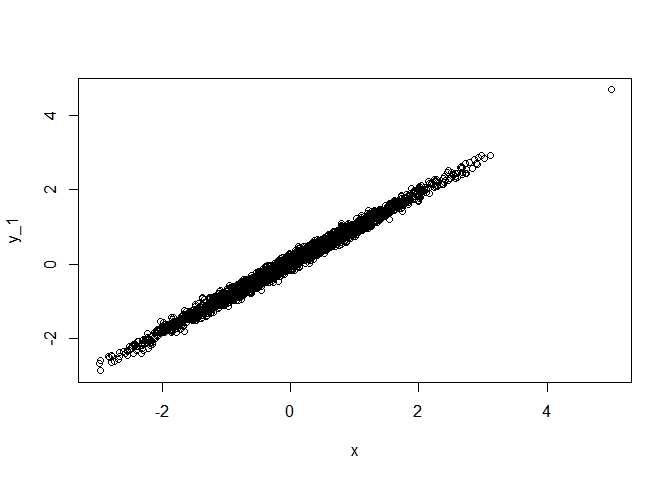
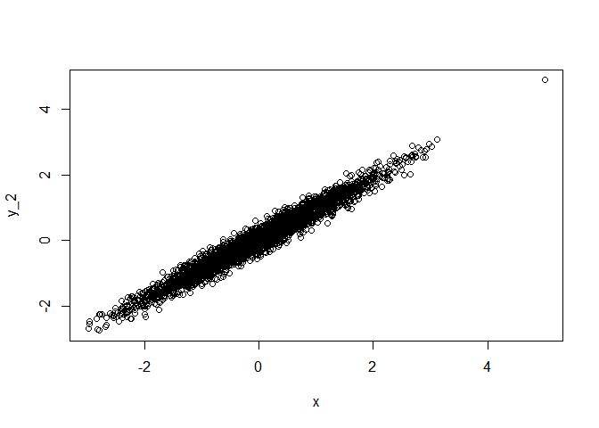
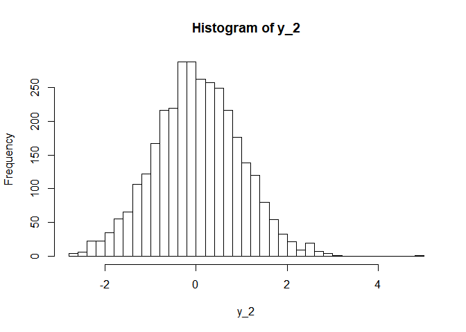
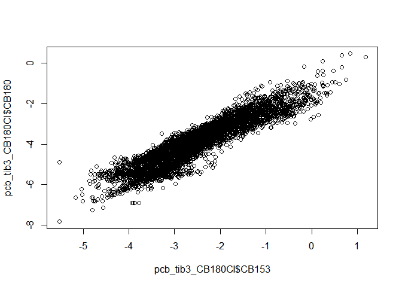
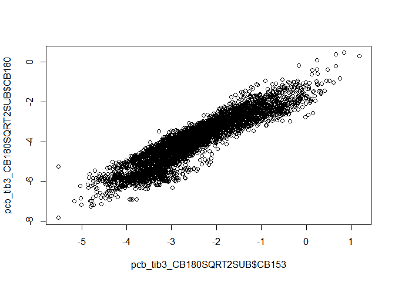
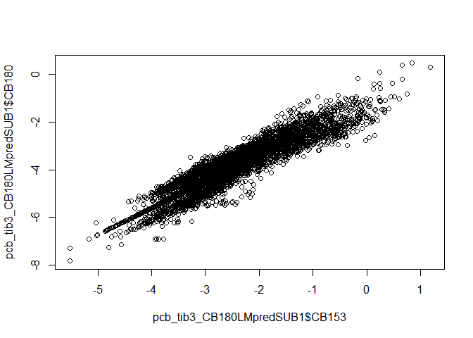
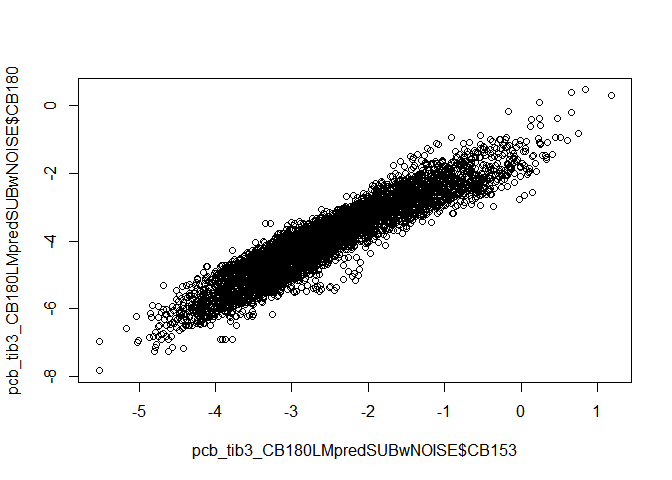
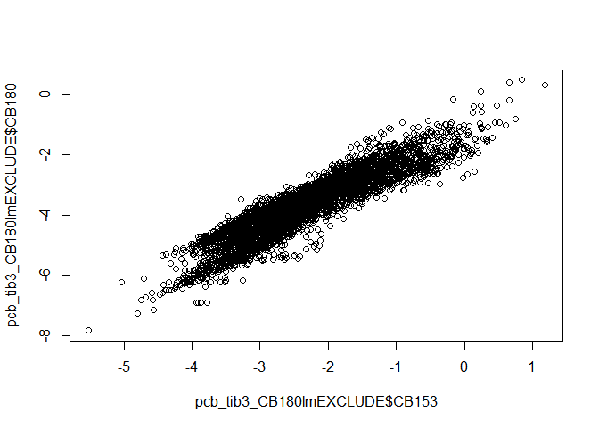
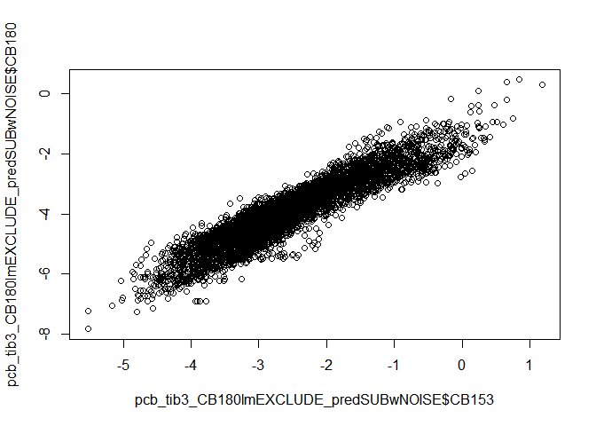

Preliminary studies of censored data
================
Marc Roddis
2/16/2020

### Preliminary studies of censored data

In our document entitled “Exploratory data analysis looking for evidence
of confounding” we found that y=CB153, x=CB138 fit a linear model y =
0.04 + 0.93x with “Adjusted R-squared” = 0.971 and 3267 degrees of
freedom. We will now create a set of three simulated datasets, which
each contain 3269 (this value is chosen so that we get 3267 degrees of
freedom) ordered pairs (x, y\_k), where `x` is a vector of realisations
`rnorm()` from a standard normal distribution, and y\_k = 0.04 + 0.93x +
“noise”, where “noise” = k \* `rnorm()`, and each (y\_1, y\_2, y\_3) are
characterised by (k=0.1, k=0.2, k=0.3) respectively. Viewing each of the
fitted models as y\_k = alpha\_k + x \* beta\_k, we see from the summary
output below that very similar values of alpha\_k and beta\_k were
obtained by fitting these three models. However, the value of k affected
the value of “Adjusted R-squared” in the manner intended, giving values
(0.99, 0.95, 0.90) for (k=0.1, k=0.2, k=0.3) respectively.

<!-- --><!-- --><!-- -->

    ## 
    ## Call:
    ## lm(formula = y_1 ~ x)
    ## 
    ## Residuals:
    ##      Min       1Q   Median       3Q      Max 
    ## -0.34971 -0.06398 -0.00086  0.06743  0.32203 
    ## 
    ## Coefficients:
    ##             Estimate Std. Error t value Pr(>|t|)    
    ## (Intercept) 0.043521   0.001711   25.44   <2e-16 ***
    ## x           0.929978   0.001706  545.08   <2e-16 ***
    ## ---
    ## Signif. codes:  0 '***' 0.001 '**' 0.01 '*' 0.05 '.' 0.1 ' ' 1
    ## 
    ## Residual standard error: 0.09781 on 3267 degrees of freedom
    ## Multiple R-squared:  0.9891, Adjusted R-squared:  0.9891 
    ## F-statistic: 2.971e+05 on 1 and 3267 DF,  p-value: < 2.2e-16

    ## 
    ## Call:
    ## lm(formula = y_2 ~ x)
    ## 
    ## Residuals:
    ##      Min       1Q   Median       3Q      Max 
    ## -0.61581 -0.12709  0.00099  0.12634  0.62006 
    ## 
    ## Coefficients:
    ##             Estimate Std. Error t value Pr(>|t|)    
    ## (Intercept) 0.037174   0.003431   10.84   <2e-16 ***
    ## x           0.922838   0.003422  269.69   <2e-16 ***
    ## ---
    ## Signif. codes:  0 '***' 0.001 '**' 0.01 '*' 0.05 '.' 0.1 ' ' 1
    ## 
    ## Residual standard error: 0.1962 on 3267 degrees of freedom
    ## Multiple R-squared:  0.957,  Adjusted R-squared:  0.957 
    ## F-statistic: 7.273e+04 on 1 and 3267 DF,  p-value: < 2.2e-16

    ## 
    ## Call:
    ## lm(formula = y_3 ~ x)
    ## 
    ## Residuals:
    ##      Min       1Q   Median       3Q      Max 
    ## -1.03915 -0.19922 -0.00469  0.20236  1.14190 
    ## 
    ## Coefficients:
    ##             Estimate Std. Error t value Pr(>|t|)    
    ## (Intercept) 0.037209   0.005309   7.009 2.91e-12 ***
    ## x           0.933146   0.005295 176.229  < 2e-16 ***
    ## ---
    ## Signif. codes:  0 '***' 0.001 '**' 0.01 '*' 0.05 '.' 0.1 ' ' 1
    ## 
    ## Residual standard error: 0.3035 on 3267 degrees of freedom
    ## Multiple R-squared:  0.9048, Adjusted R-squared:  0.9048 
    ## F-statistic: 3.106e+04 on 1 and 3267 DF,  p-value: < 2.2e-16

<!-- -->

We will base our simulation methodology upon the exploratory work
described above by choosing values for alpha, beta and k to correspond
to those obtained from fitting a linear model to the relevant part of
the dataset in each instance.

We will now continue with `lm_fit2` and introduce methods described in
Chapter 11 of Helsel’s book to deal with censored data for different
values of LOQ (level of quantification). We will first learn how to do
this by installing the “NADA for R” package and attempting to reproduce
some of the results described in Helsel’s book (which is referred to by
page number from now on).

### Attempt to reproduce Helsel’s results using the “NADA for R” package

We begin by glimpsing the dataset `ShePyrene` from page 299.

We will now use the functions from page 301 “14.2.5 Correlation and
Regression for Censored Data”. Attempting to reproduce the results from
page 228 resulted in an error message.

### Comparison of the strength of association when including or excluding censored values when fitting the linear model (proportion of censored values = 0.0022)

We begin by creating `pcb_tib3` (see “Cleaning the pcb dataset” for
documentation), which has 5028 observations. In this tibble CB138 and
CB153 have no missing values, and CB153 has no censored values whereas
CB138 has 11 censored values.

We will now add the variable CI138 and denote the resulting tibble as
`pcb_tib3_CI138`. CI138 is a censoring indicator for CB138; it is TRUE
for censored observations (and FALSE for uncensored). We then use the
cenreg() function on `pcb_tib3_CI138` in accordance with page 301.
Contrary to my expectation, the likelihood-r value (which gives a
measure of the degree of association) is higher (which means stronger
association) when cenreg() uses a gaussian distribution than when
cenreg() uses a log-normal distribution, despite the fact that the
variables CB153 and CB138 themselves have (approximate) log-normal
distributions; the likelihood-r values are (0.965, 0.768) for
dist=(gaussian, log-normal) respectively.

    ##                         Value Std. Error      z       p
    ## (Intercept)           0.00799   0.000607   13.2 1.3e-39
    ## pcb_tib3_CI138$CB153  0.66650   0.002557  260.7 0.0e+00
    ## Log(scale)           -3.36242   0.009972 -337.2 0.0e+00
    ## 
    ## Scale = 0.0347 
    ## 
    ## Gaussian distribution
    ## Loglik(model)= 9719.3   Loglik(intercept only)= 2993.8 
    ## Loglik-r:  0.9649391 
    ## 
    ## Chisq= 13450.94 on 1 degrees of freedom, p= 0 
    ## Number of Newton-Raphson Iterations: 6 
    ## n = 5028

    ##                       Value Std. Error      z p
    ## (Intercept)          -3.400    0.01147 -296.5 0
    ## pcb_tib3_CI138$CB153  4.104    0.04831   84.9 0
    ## Log(scale)           -0.424    0.00999  -42.4 0
    ## 
    ## Scale = 0.655 
    ## 
    ## Log Normal distribution
    ## Loglik(model)= 9126.2   Loglik(intercept only)= 6890.2 
    ## Loglik-r:  0.7675364 
    ## 
    ## Chisq= 4472.08 on 1 degrees of freedom, p= 0 
    ## Number of Newton-Raphson Iterations: 5 
    ## n = 5028

We will now replace CB138 and CB153 with the logarithm of their values
and denote the resulting tibble as `pcb_tib3_CI138_prelog`. We will then
apply cenreg() using gaussian and log-normal distributions (as we did
previously). The likelihood-r values are (0.978, 0.768) for
dist=(gaussian, log-normal) respectively.

    ## Warning in Surv(start, end, type = "interval2"): Invalid interval: start > stop,
    ## NA created

    ##                              Value Std. Error      z p
    ## (Intercept)                 -0.325    0.00801  -40.6 0
    ## pcb_tib3_CI138_prelog$CB153  1.000    0.00298  335.1 0
    ## Log(scale)                  -1.559    0.00998 -156.1 0
    ## 
    ## Scale = 0.21 
    ## 
    ## Gaussian distribution
    ## Loglik(model)= 700.8   Loglik(intercept only)= -7206.2 
    ## Loglik-r:  0.9783849 
    ## 
    ## Chisq= 15814 on 1 degrees of freedom, p= 0 
    ## Number of Newton-Raphson Iterations: 8 
    ## n =5017 (11 observations deleted due to missingness)

    ##                       Value Std. Error      z p
    ## (Intercept)          -3.400    0.01147 -296.5 0
    ## pcb_tib3_CI138$CB153  4.104    0.04831   84.9 0
    ## Log(scale)           -0.424    0.00999  -42.4 0
    ## 
    ## Scale = 0.655 
    ## 
    ## Log Normal distribution
    ## Loglik(model)= 9126.2   Loglik(intercept only)= 6890.2 
    ## Loglik-r:  0.7675364 
    ## 
    ## Chisq= 4472.08 on 1 degrees of freedom, p= 0 
    ## Number of Newton-Raphson Iterations: 5 
    ## n = 5028

Although we do not yet understand the above unexpected results, we did
get the highest likelihood-r value by using dist=gaussian on the
logarithmed data, which is the way I had intended to do it all along. We
will therefore proceed as we had intended. We begin by comparing the
likelihood-r = 0.978 value with the Adjusted-R-squared=0.957 value we
obtained in our document “Cleaning the pcb dataset”; squaring 0.978
gives 0.956, so these values are very similar. We expected this
similarity because only 11 of 5028 values were censored so the
proportion of censored values was 0.0022 (which is very low).

### Comparison of the strength of association between x=CB153 and y=CB180 (proportion of censored values = 0.115) for exclusion, substitution and use of cenreg()

We will repeat the process described in the previous section, except
that we will now use CB180 as the response variable because
`pcb_tib3$CB180` has only 44 missing values but 571 censored values.
This means that we can remove the observations for which the CB180 value
is missing and still retain the overwhelming majority of observations.
This comparison will correspond to that of the previous section with the
sole exception that the proportion of censored values is much higher
(0.115) than previously (0.0022).

From the below output, we see that the value of likelihood-r for
`tib3_cenreg_180` was 0.918 (and 0.918^2=0.843).

    ## Warning in Surv(start, end, type = "interval2"): Invalid interval: start > stop,
    ## NA created

    ##                        Value Std. Error     z p
    ## (Intercept)            -1.24    0.01720 -72.2 0
    ## pcb_tib3_CB180CI$CB153  1.05    0.00686 153.8 0
    ## Log(scale)             -0.86    0.01064 -80.8 0
    ## 
    ## Scale = 0.423 
    ## 
    ## Gaussian distribution
    ## Loglik(model)= -2467.3   Loglik(intercept only)= -6550.1 
    ## Loglik-r:  0.9180497 
    ## 
    ## Chisq= 8165.52 on 1 degrees of freedom, p= 0 
    ## Number of Newton-Raphson Iterations: 6 
    ## n =4413 (571 observations deleted due to missingness)

<!-- -->

We will now mutate `pcb_tib3_CB180CI` by substitution of each of the
censored values by LOQ/sqrt(2) and then fit a linear model to the
resulting tibble `pcb_tib3_CB180SUB`; the Adjusted R-squared was 0.852
in this case which is similar to the value 0.843 we obtained above by
squaring the likelihood-r value. The scatter plot below has a very
similar appearance to the one above; we see that these plots are not
identical since (for example) the plot above shows three adjacent
touching points aligned approximately vertically whereas the plot below
does not have that row of three touching points.

    ## 
    ## Call:
    ## lm(formula = pcb_tib3_CB180SQRT2SUB$CB180 ~ pcb_tib3_CB180SQRT2SUB$CB153)
    ## 
    ## Residuals:
    ##      Min       1Q   Median       3Q      Max 
    ## -1.83217 -0.31998  0.03652  0.36880  2.04274 
    ## 
    ## Coefficients:
    ##                              Estimate Std. Error t value Pr(>|t|)    
    ## (Intercept)                  -1.16411    0.01762  -66.07   <2e-16 ***
    ## pcb_tib3_CB180SQRT2SUB$CB153  1.11048    0.00655  169.54   <2e-16 ***
    ## ---
    ## Signif. codes:  0 '***' 0.001 '**' 0.01 '*' 0.05 '.' 0.1 ' ' 1
    ## 
    ## Residual standard error: 0.4631 on 4982 degrees of freedom
    ## Multiple R-squared:  0.8523, Adjusted R-squared:  0.8523 
    ## F-statistic: 2.874e+04 on 1 and 4982 DF,  p-value: < 2.2e-16

<!-- -->

We will now use the methodology documented in “Cleaning the pcb dataset”
to substitute the CB180 censored values with values predicted by various
linear models, We begin by using the above model `tib3_SUB_180`. We get
Adjusted R-squared = 0.879, which is slightly higher than before.
However, we see from the scatter plot below that substitution using
predicted values has given plotted points that lie on the regression
line (these points are seen in the lower left of the plot) so the
increase in R-squared is at the expense of unrealistic alignment of the
substituted points.

    ## Warning in log(CB180): NaNs produced

    ## 
    ## Call:
    ## lm(formula = pcb_tib3_CB180LMpredSUB1$CB180 ~ pcb_tib3_CB180LMpredSUB1$CB153)
    ## 
    ## Residuals:
    ##      Min       1Q   Median       3Q      Max 
    ## -1.64479 -0.21598 -0.02085  0.31486  1.27104 
    ## 
    ## Coefficients:
    ##                                 Estimate Std. Error t value Pr(>|t|)    
    ## (Intercept)                    -1.205686   0.015222  -79.21   <2e-16 ***
    ## pcb_tib3_CB180LMpredSUB1$CB153  1.075557   0.005659  190.07   <2e-16 ***
    ## ---
    ## Signif. codes:  0 '***' 0.001 '**' 0.01 '*' 0.05 '.' 0.1 ' ' 1
    ## 
    ## Residual standard error: 0.4001 on 4982 degrees of freedom
    ## Multiple R-squared:  0.8788, Adjusted R-squared:  0.8788 
    ## F-statistic: 3.613e+04 on 1 and 4982 DF,  p-value: < 2.2e-16

<!-- -->

The values of the fitted coefficients (-1.205686, 1.075557) are close to
but not equal to the coefficients (-1.16411, 1.11048) from the
prediction equation, so we will now augment this procedure by performing
a second iteration to see whether we can attain convergence for the
outputted coefficients (of the fitted model) with respect to the
inputted coefficients (of the prediction equation).

    ## Warning in log(CB180): NaNs produced

    ## 
    ## Call:
    ## lm(formula = pcb_tib3_CB180LMpredSUB2$CB180 ~ pcb_tib3_CB180LMpredSUB2$CB153)
    ## 
    ## Residuals:
    ##      Min       1Q   Median       3Q      Max 
    ## -1.67318 -0.22052 -0.01933  0.30556  1.28032 
    ## 
    ## Coefficients:
    ##                                 Estimate Std. Error t value Pr(>|t|)    
    ## (Intercept)                    -1.230632   0.015161  -81.17   <2e-16 ***
    ## pcb_tib3_CB180LMpredSUB2$CB153  1.061417   0.005636  188.32   <2e-16 ***
    ## ---
    ## Signif. codes:  0 '***' 0.001 '**' 0.01 '*' 0.05 '.' 0.1 ' ' 1
    ## 
    ## Residual standard error: 0.3985 on 4982 degrees of freedom
    ## Multiple R-squared:  0.8768, Adjusted R-squared:  0.8768 
    ## F-statistic: 3.546e+04 on 1 and 4982 DF,  p-value: < 2.2e-16

<!-- -->

We now perform a third iteration.

    ## Warning in log(CB180): NaNs produced

    ## 
    ## Call:
    ## lm(formula = pcb_tib3_CB180LMpredSUB3$CB180 ~ pcb_tib3_CB180LMpredSUB3$CB153)
    ## 
    ## Residuals:
    ##      Min       1Q   Median       3Q      Max 
    ## -1.68223 -0.22170 -0.00731  0.30197  1.28336 
    ## 
    ## Coefficients:
    ##                                 Estimate Std. Error t value Pr(>|t|)    
    ## (Intercept)                    -1.238696   0.015155  -81.73   <2e-16 ***
    ## pcb_tib3_CB180LMpredSUB3$CB153  1.056880   0.005634  187.59   <2e-16 ***
    ## ---
    ## Signif. codes:  0 '***' 0.001 '**' 0.01 '*' 0.05 '.' 0.1 ' ' 1
    ## 
    ## Residual standard error: 0.3984 on 4982 degrees of freedom
    ## Multiple R-squared:  0.876,  Adjusted R-squared:  0.876 
    ## F-statistic: 3.519e+04 on 1 and 4982 DF,  p-value: < 2.2e-16

<!-- -->

We now attain convergence (six decimal places) on this fourth iteration.
However, the resulting model has Adjusted-R-squared = 0.876, which is
lower than the value (0.879) from the first iteration, so this iterative
procedure appears to have no merit.

    ## Warning in log(CB180): NaNs produced

    ## 
    ## Call:
    ## lm(formula = pcb_tib3_CB180LMpredSUB3$CB180 ~ pcb_tib3_CB180LMpredSUB3$CB153)
    ## 
    ## Residuals:
    ##      Min       1Q   Median       3Q      Max 
    ## -1.68223 -0.22170 -0.00731  0.30197  1.28336 
    ## 
    ## Coefficients:
    ##                                 Estimate Std. Error t value Pr(>|t|)    
    ## (Intercept)                    -1.238696   0.015155  -81.73   <2e-16 ***
    ## pcb_tib3_CB180LMpredSUB3$CB153  1.056880   0.005634  187.59   <2e-16 ***
    ## ---
    ## Signif. codes:  0 '***' 0.001 '**' 0.01 '*' 0.05 '.' 0.1 ' ' 1
    ## 
    ## Residual standard error: 0.3984 on 4982 degrees of freedom
    ## Multiple R-squared:  0.876,  Adjusted R-squared:  0.876 
    ## F-statistic: 3.519e+04 on 1 and 4982 DF,  p-value: < 2.2e-16

<!-- -->

We will now perform a variation on the first iteration above by adding
`NOISE = 0.4*rnorm(4984)` to the predicted values to give the scatter
plot a more realistic appearance. The resulting fitted model has
coefficients (-1.21328, 1.07028) and Adjusted-R-squared = 0.866.

    ## Warning in log(CB180): NaNs produced

    ## 
    ## Call:
    ## lm(formula = pcb_tib3_CB180LMpredSUBwNOISE$CB180 ~ pcb_tib3_CB180LMpredSUBwNOISE$CB153)
    ## 
    ## Residuals:
    ##      Min       1Q   Median       3Q      Max 
    ## -1.65068 -0.29030  0.01841  0.32838  1.31430 
    ## 
    ## Coefficients:
    ##                                      Estimate Std. Error t value Pr(>|t|)    
    ## (Intercept)                         -1.210940   0.015950  -75.92   <2e-16 ***
    ## pcb_tib3_CB180LMpredSUBwNOISE$CB153  1.072601   0.005929  180.89   <2e-16 ***
    ## ---
    ## Signif. codes:  0 '***' 0.001 '**' 0.01 '*' 0.05 '.' 0.1 ' ' 1
    ## 
    ## Residual standard error: 0.4192 on 4982 degrees of freedom
    ## Multiple R-squared:  0.8679, Adjusted R-squared:  0.8678 
    ## F-statistic: 3.272e+04 on 1 and 4982 DF,  p-value: < 2.2e-16

<!-- -->

We will now exclude the observations for which the value of CB180 is
censored and fit a linear model and compare with our previous results.
The resulting fitted model has coefficients (-1.242473, 1.054756) and
Adjusted-R-squared = 0.843; these coefficients are then used to make
predictions, which are substituted and then the linear model is fit as
above. The resulting fitted model has coefficients (-1.240961, 1.056237)
and Adjusted-R-squared = 0.864.

    ## 
    ## Call:
    ## lm(formula = pcb_tib3_CB180lmEXCLUDE$CB180 ~ pcb_tib3_CB180lmEXCLUDE$CB153)
    ## 
    ## Residuals:
    ##      Min       1Q   Median       3Q      Max 
    ## -1.68647 -0.28514  0.02534  0.33065  1.28479 
    ## 
    ## Coefficients:
    ##                                Estimate Std. Error t value Pr(>|t|)    
    ## (Intercept)                   -1.242473   0.017208   -72.2   <2e-16 ***
    ## pcb_tib3_CB180lmEXCLUDE$CB153  1.054756   0.006858   153.8   <2e-16 ***
    ## ---
    ## Signif. codes:  0 '***' 0.001 '**' 0.01 '*' 0.05 '.' 0.1 ' ' 1
    ## 
    ## Residual standard error: 0.4233 on 4411 degrees of freedom
    ## Multiple R-squared:  0.8428, Adjusted R-squared:  0.8428 
    ## F-statistic: 2.365e+04 on 1 and 4411 DF,  p-value: < 2.2e-16

<!-- -->

    ## Warning in log(CB180): NaNs produced

    ## 
    ## Call:
    ## lm(formula = pcb_tib3_CB180lmEXCLUDE_predSUBwNOISE$CB180 ~ pcb_tib3_CB180lmEXCLUDE_predSUBwNOISE$CB153)
    ## 
    ## Residuals:
    ##     Min      1Q  Median      3Q     Max 
    ## -1.6845 -0.2843  0.0231  0.3268  1.2845 
    ## 
    ## Coefficients:
    ##                                              Estimate Std. Error t value
    ## (Intercept)                                 -1.241177   0.015984  -77.65
    ## pcb_tib3_CB180lmEXCLUDE_predSUBwNOISE$CB153  1.055622   0.005942  177.65
    ##                                             Pr(>|t|)    
    ## (Intercept)                                   <2e-16 ***
    ## pcb_tib3_CB180lmEXCLUDE_predSUBwNOISE$CB153   <2e-16 ***
    ## ---
    ## Signif. codes:  0 '***' 0.001 '**' 0.01 '*' 0.05 '.' 0.1 ' ' 1
    ## 
    ## Residual standard error: 0.4201 on 4982 degrees of freedom
    ## Multiple R-squared:  0.8637, Adjusted R-squared:  0.8636 
    ## F-statistic: 3.156e+04 on 1 and 4982 DF,  p-value: < 2.2e-16

<!-- -->

In summary, three main approaches were tried: exclusion; substitution;
use of cenreg(). Sub-approaches that were tried were: using substitution
with predicted values with or without noise; iterative prediction,
mutation, fitting. The coefficients of the fitted model and the
Adjusted-R-squared values were recorded in each case and found to have
similar values across all approaches. For the cenreg() method, the value
of likelihood-r was reported and its squared value was found to be very
similar to the Adjusted R-squared values from the other approaches.

Our next goal is to further develop the simulation study to make it more
meaningful in relation to our dataset of interest.
