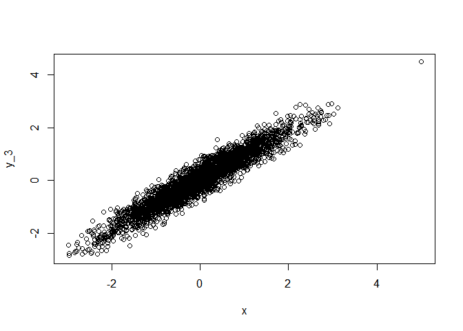

Preliminary studies of censored data
================
Marc Roddis
2/16/2020

### Preliminary studies of censored data

In our document entitled “Exploratory data analysis looking for evidence
of confounding” we found that y=CB153, x=CB138 fit a linear model y =
0.04 + 0.93x with “Adjusted R-squared” = 0.971 and 3267 degrees of
freedom. We will now create a set of three simulated datasets, which
each contain 3269 (this value is chosen so that we get 3267 degrees of
freedom) ordered pairs (x, y\_k), where `x` is a vector of realisations
`rnorm()` from a standard normal distribution, and y\_k = 0.04 + 0.93x +
“noise”, where “noise” = k \* `rnorm()`, and each (y\_1, y\_2, y\_3) are
characterised by (k=0.1, k=0.2, k=0.3) respectively. Viewing each of the
fitted models as y\_k = alpha\_k + x \* beta\_k, we see from the summary
output below that very similar values of alpha\_k and beta\_k were
obtained by fitting these three models. However, the value of k affected
the value of “Adjusted R-squared” in the manner intended, giving values
(0.99, 0.95, 0.90) for (k=0.1, k=0.2, k=0.3) respectively.

<!-- --><!-- --><!-- -->

    ## 
    ## Call:
    ## lm(formula = y_1 ~ x)
    ## 
    ## Residuals:
    ##      Min       1Q   Median       3Q      Max 
    ## -0.34645 -0.06924  0.00106  0.06786  0.42453 
    ## 
    ## Coefficients:
    ##             Estimate Std. Error t value Pr(>|t|)    
    ## (Intercept) 0.037005   0.001748   21.17   <2e-16 ***
    ## x           0.928960   0.001768  525.38   <2e-16 ***
    ## ---
    ## Signif. codes:  0 '***' 0.001 '**' 0.01 '*' 0.05 '.' 0.1 ' ' 1
    ## 
    ## Residual standard error: 0.09993 on 3267 degrees of freedom
    ## Multiple R-squared:  0.9883, Adjusted R-squared:  0.9883 
    ## F-statistic: 2.76e+05 on 1 and 3267 DF,  p-value: < 2.2e-16

    ## 
    ## Call:
    ## lm(formula = y_2 ~ x)
    ## 
    ## Residuals:
    ##      Min       1Q   Median       3Q      Max 
    ## -0.80860 -0.12834 -0.00404  0.13267  0.64006 
    ## 
    ## Coefficients:
    ##             Estimate Std. Error t value Pr(>|t|)    
    ## (Intercept) 0.039132   0.003469   11.28   <2e-16 ***
    ## x           0.929577   0.003510  264.85   <2e-16 ***
    ## ---
    ## Signif. codes:  0 '***' 0.001 '**' 0.01 '*' 0.05 '.' 0.1 ' ' 1
    ## 
    ## Residual standard error: 0.1984 on 3267 degrees of freedom
    ## Multiple R-squared:  0.9555, Adjusted R-squared:  0.9555 
    ## F-statistic: 7.014e+04 on 1 and 3267 DF,  p-value: < 2.2e-16

    ## 
    ## Call:
    ## lm(formula = y_3 ~ x)
    ## 
    ## Residuals:
    ##      Min       1Q   Median       3Q      Max 
    ## -0.94355 -0.19798 -0.00338  0.19231  1.06244 
    ## 
    ## Coefficients:
    ##             Estimate Std. Error t value Pr(>|t|)    
    ## (Intercept) 0.029288   0.005218   5.613 2.16e-08 ***
    ## x           0.921869   0.005279 174.627  < 2e-16 ***
    ## ---
    ## Signif. codes:  0 '***' 0.001 '**' 0.01 '*' 0.05 '.' 0.1 ' ' 1
    ## 
    ## Residual standard error: 0.2984 on 3267 degrees of freedom
    ## Multiple R-squared:  0.9032, Adjusted R-squared:  0.9032 
    ## F-statistic: 3.049e+04 on 1 and 3267 DF,  p-value: < 2.2e-16

We will base our simulation methodology upon the exploratory work
described above by choosing values for alpha, beta and k to correspond
to those obtained from fitting a linear model to the relevant part of
the dataset in each instance.

We will now continue with `lm_fit2` and introduce methods described in
Chapter 11 of Helsel’s book to deal with censored data for different
values of LOQ (level of quantification). We will first learn how to do
this by installing the “NADA for R” package and attempting to reproduce
some of the results described in Helsel’s book (which is referred to by
page number from now on).

### Attempt to reproduce Helsel’s results using the “NADA for R” package

We begin by glimpsing the dataset `ShePyrene` from page 299.

We will now use the functions from page 301 “14.2.5 Correlation and
Regression for Censored Data”. Attempting to reproduce the results from
page 228 resulted in an error message.

### Comparison of the strength of association when including or excluding censored values when fitting the linear model (proportion of censored values = 0.0022)

We begin by creating `pcb_tib3` (see “Cleaning the pcb dataset” for
documentation), which has 5028 observations. In this tibble CB138 and
CB153 have no missing values, and CB153 has no censored values whereas
CB138 has 11 censored values.

We will now add the variable CI138 and denote the resulting tibble as
`pcb_tib3_CI138`. CI138 is a censoring indicator for CB138; it is TRUE
for censored observations (and FALSE for uncensored). We then use the
cenreg() function on `pcb_tib3_CI138` in accordance with page 301.
Contrary to my expectation, the likelihood-r value (which gives a
measure of the degree of association) is higher (which means stronger
association) when cenreg() uses a gaussian distribution than when
cenreg() uses a log-normal distribution, despite the fact that the
variables CB153 and CB138 themselves have (approximate) log-normal
distributions; the likelihood-r values are (0.965, 0.768) for
dist=(gaussian, log-normal) respectively.

    ##                         Value Std. Error      z       p
    ## (Intercept)           0.00799   0.000607   13.2 1.3e-39
    ## pcb_tib3_CI138$CB153  0.66650   0.002557  260.7 0.0e+00
    ## Log(scale)           -3.36242   0.009972 -337.2 0.0e+00
    ## 
    ## Scale = 0.0347 
    ## 
    ## Gaussian distribution
    ## Loglik(model)= 9719.3   Loglik(intercept only)= 2993.8 
    ## Loglik-r:  0.9649391 
    ## 
    ## Chisq= 13450.94 on 1 degrees of freedom, p= 0 
    ## Number of Newton-Raphson Iterations: 6 
    ## n = 5028

    ##                       Value Std. Error      z p
    ## (Intercept)          -3.400    0.01147 -296.5 0
    ## pcb_tib3_CI138$CB153  4.104    0.04831   84.9 0
    ## Log(scale)           -0.424    0.00999  -42.4 0
    ## 
    ## Scale = 0.655 
    ## 
    ## Log Normal distribution
    ## Loglik(model)= 9126.2   Loglik(intercept only)= 6890.2 
    ## Loglik-r:  0.7675364 
    ## 
    ## Chisq= 4472.08 on 1 degrees of freedom, p= 0 
    ## Number of Newton-Raphson Iterations: 5 
    ## n = 5028

We will now replace CB138 and CB153 with the logarithm of their values
and denote the resulting tibble as `pcb_tib3_CI138_prelog`. We will then
apply cenreg() using gaussian and log-normal distributions (as we did
previously). The likelihood-r values are (0.978, 0.768) for
dist=(gaussian, log-normal) respectively.

    ## Warning in Surv(start, end, type = "interval2"): Invalid interval: start > stop,
    ## NA created

    ##                              Value Std. Error      z p
    ## (Intercept)                 -0.325    0.00801  -40.6 0
    ## pcb_tib3_CI138_prelog$CB153  1.000    0.00298  335.1 0
    ## Log(scale)                  -1.559    0.00998 -156.1 0
    ## 
    ## Scale = 0.21 
    ## 
    ## Gaussian distribution
    ## Loglik(model)= 700.8   Loglik(intercept only)= -7206.2 
    ## Loglik-r:  0.9783849 
    ## 
    ## Chisq= 15814 on 1 degrees of freedom, p= 0 
    ## Number of Newton-Raphson Iterations: 8 
    ## n =5017 (11 observations deleted due to missingness)

    ##                       Value Std. Error      z p
    ## (Intercept)          -3.400    0.01147 -296.5 0
    ## pcb_tib3_CI138$CB153  4.104    0.04831   84.9 0
    ## Log(scale)           -0.424    0.00999  -42.4 0
    ## 
    ## Scale = 0.655 
    ## 
    ## Log Normal distribution
    ## Loglik(model)= 9126.2   Loglik(intercept only)= 6890.2 
    ## Loglik-r:  0.7675364 
    ## 
    ## Chisq= 4472.08 on 1 degrees of freedom, p= 0 
    ## Number of Newton-Raphson Iterations: 5 
    ## n = 5028

Although we do not yet understand the above unexpected results, we did
get the highest likelihood-r value by using dist=gaussian on the
logarithmed data, which is the way I had intended to do it all along. We
will therefore proceed as we had intended. We begin by comparing the
likelihood-r = 0.978 value with the Adjusted-R-squared=0.957 value we
obtained in our document “Cleaning the pcb dataset”; squaring 0.978
gives 0.956, so these values are very similar. We expected this
similarity because only 11 of 5028 values were censored so the
proportion of censored values was 0.0022 (which is very low).

### Comparison of the strength of association when including or excluding censored values when fitting the linear model (proportion of censored values \> 0.0022)

We will repeat the process described in the previous section, except
that we will now use CB180 as the response variable because CB180 has
only 23 missing values but 578 censored values. This means that we can
remove the observations for which the CB180 value is missing, which will
mean that this comparison corresponds to that of the previous section
with the sole exception that the proportion of censored values is much
higher (0.115).
