CB28 and CB52 vs YEAR trend for various augmented substituted or
filtered datasets
================
Marc Roddis
3/5/2020

In the first section of this document we focus on CB28 because this
variable has the largest number of censored values. In the second
section, we focus on CB52 because this variable has the largest number
of missing values. In the third section we focus on CB153 because it has
no missing values.

### Analysis of the trend CB28 vs YEAR

#### Creation and trend analysis for the `CB28_filtered` dataset

We show below a scatter plot and fitted linear model summary for CB28
versus YEAR from `CB28_filtered`; this dataset was created by removal of
censored values. The fitted linear model has na.omit as the na.action by
default; the slope coefficient is -0.0346; SE = 0.0015; p-value \<
2e-16; Adjusted R-squared = 0.18.

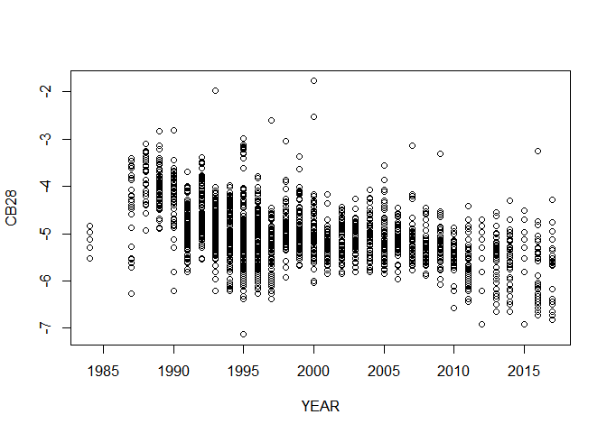<!-- -->

    ## 
    ## Call:
    ## lm(formula = CB28 ~ YEAR)
    ## 
    ## Residuals:
    ##     Min      1Q  Median      3Q     Max 
    ## -2.1890 -0.3766 -0.0123  0.3259  3.3405 
    ## 
    ## Coefficients:
    ##              Estimate Std. Error t value Pr(>|t|)    
    ## (Intercept) 64.030985   3.085083   20.75   <2e-16 ***
    ## YEAR        -0.034573   0.001543  -22.41   <2e-16 ***
    ## ---
    ## Signif. codes:  0 '***' 0.001 '**' 0.01 '*' 0.05 '.' 0.1 ' ' 1
    ## 
    ## Residual standard error: 0.5693 on 2279 degrees of freedom
    ## Multiple R-squared:  0.1805, Adjusted R-squared:  0.1802 
    ## F-statistic: 502.1 on 1 and 2279 DF,  p-value: < 2.2e-16

### Time trend analysis of CB28 versus YEAR from `vB1` and `completed_vB1`

These datasets were created in our document “Imputation based on van
Buuren’s book”. We show below a scatter plot and fitted linear model
summary for CB28 versus YEAR from `completed_vB1`. We see that the slope
coefficient is -0.0440 with SE = 0.0009 and p-value \< 2e-16; Adjusted
R-squared = 0.31.

    ## The following objects are masked from CB28_filtered:
    ## 
    ##     CB28, YEAR

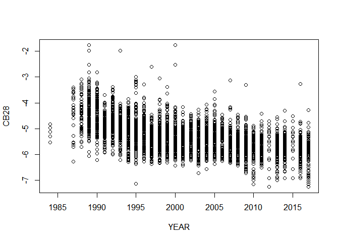<!-- -->

    ## 
    ## Call:
    ## lm(formula = CB28 ~ YEAR)
    ## 
    ## Residuals:
    ##     Min      1Q  Median      3Q     Max 
    ## -2.0567 -0.3875 -0.0302  0.3323  3.5200 
    ## 
    ## Coefficients:
    ##               Estimate Std. Error t value Pr(>|t|)    
    ## (Intercept) 82.7607006  1.8529632   44.66   <2e-16 ***
    ## YEAR        -0.0440275  0.0009255  -47.57   <2e-16 ***
    ## ---
    ## Signif. codes:  0 '***' 0.001 '**' 0.01 '*' 0.05 '.' 0.1 ' ' 1
    ## 
    ## Residual standard error: 0.5454 on 5026 degrees of freedom
    ## Multiple R-squared:  0.3105, Adjusted R-squared:  0.3103 
    ## F-statistic:  2263 on 1 and 5026 DF,  p-value: < 2.2e-16

    ## 
    ## Call:
    ## lm(formula = CB28 ~ YEAR, na.action = na.omit)
    ## 
    ## Residuals:
    ##     Min      1Q  Median      3Q     Max 
    ## -2.0567 -0.3875 -0.0302  0.3323  3.5200 
    ## 
    ## Coefficients:
    ##               Estimate Std. Error t value Pr(>|t|)    
    ## (Intercept) 82.7607006  1.8529632   44.66   <2e-16 ***
    ## YEAR        -0.0440275  0.0009255  -47.57   <2e-16 ***
    ## ---
    ## Signif. codes:  0 '***' 0.001 '**' 0.01 '*' 0.05 '.' 0.1 ' ' 1
    ## 
    ## Residual standard error: 0.5454 on 5026 degrees of freedom
    ## Multiple R-squared:  0.3105, Adjusted R-squared:  0.3103 
    ## F-statistic:  2263 on 1 and 5026 DF,  p-value: < 2.2e-16

We now show a scatter plot and fitted linear model summary for CB28
versus YEAR from `vB1`. We see that the slope coefficient is -0.0427
with SE = 0.0010 and p-value \< 2e-16; Adjusted R-squared = 0.29.

    ## The following objects are masked from completed_vB1:
    ## 
    ##     ACCNR, ALDR, CB101, CB118, CB138, CB153, CB180, CB28, CB52, FPRC,
    ##     LAT, LOC, LONG, NHOM, SPECIES, TOTL, TOTV, YEAR

    ## The following objects are masked from CB28_filtered:
    ## 
    ##     CB28, YEAR

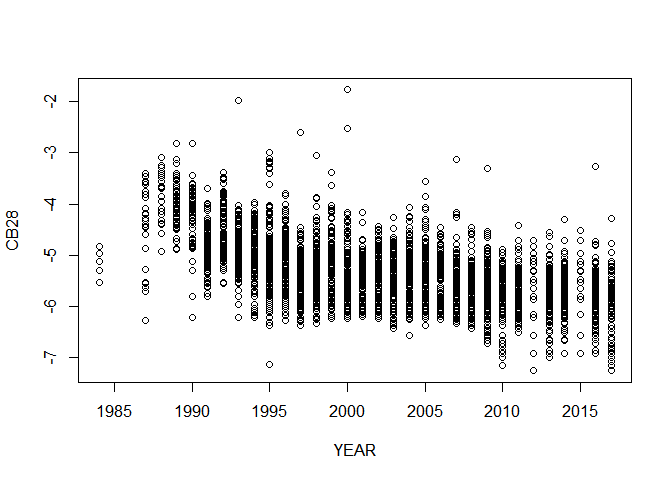<!-- -->

    ## 
    ## Call:
    ## lm(formula = CB28 ~ YEAR)
    ## 
    ## Residuals:
    ##     Min      1Q  Median      3Q     Max 
    ## -2.0512 -0.3822 -0.0242  0.3283  3.5191 
    ## 
    ## Coefficients:
    ##              Estimate Std. Error t value Pr(>|t|)    
    ## (Intercept) 80.202418   2.014577   39.81   <2e-16 ***
    ## YEAR        -0.042748   0.001006  -42.51   <2e-16 ***
    ## ---
    ## Signif. codes:  0 '***' 0.001 '**' 0.01 '*' 0.05 '.' 0.1 ' ' 1
    ## 
    ## Residual standard error: 0.5293 on 4395 degrees of freedom
    ##   (631 observations deleted due to missingness)
    ## Multiple R-squared:  0.2914, Adjusted R-squared:  0.2912 
    ## F-statistic:  1807 on 1 and 4395 DF,  p-value: < 2.2e-16

### Analysis of the trend CB52 vs YEAR

#### Creation and trend analysis for the `CB52_filtered` dataset

We show below a scatter plot and fitted linear model summary for CB52
versus YEAR from `CB52_filtered`; this dataset was created by removal of
censored values. The fitted linear model has na.omit as the na.action by
default; the slope coefficient is -0.0485; SE = 0.0014; p-value \<
2e-16; Adjusted R-squared = 0.26.

    ## The following objects are masked from vB1:
    ## 
    ##     CB52, YEAR

    ## The following objects are masked from completed_vB1:
    ## 
    ##     CB52, YEAR

    ## The following object is masked from CB28_filtered:
    ## 
    ##     YEAR

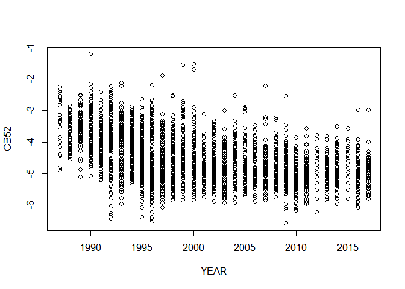<!-- -->

    ## 
    ## Call:
    ## lm(formula = CB52 ~ YEAR)
    ## 
    ## Residuals:
    ##      Min       1Q   Median       3Q      Max 
    ## -2.36222 -0.48363 -0.03332  0.46853  2.94601 
    ## 
    ## Coefficients:
    ##              Estimate Std. Error t value Pr(>|t|)    
    ## (Intercept) 92.593784   2.887141   32.07   <2e-16 ***
    ## YEAR        -0.048529   0.001443  -33.64   <2e-16 ***
    ## ---
    ## Signif. codes:  0 '***' 0.001 '**' 0.01 '*' 0.05 '.' 0.1 ' ' 1
    ## 
    ## Residual standard error: 0.684 on 3232 degrees of freedom
    ## Multiple R-squared:  0.2593, Adjusted R-squared:  0.2591 
    ## F-statistic:  1131 on 1 and 3232 DF,  p-value: < 2.2e-16

### Time trend analysis of CB52 versus YEAR from `vB1` and `completed_vB1`

These datasets were created in our document “Imputation based on van
Buuren’s book”. We show below a scatter plot and fitted linear model
summary for CB52 versus YEAR from `completed_vB1`. We see that the slope
coefficient is -0.0547 with SE = 0.0013 and p-value \< 2e-16; Adjusted
R-squared = 0.27.

    ## The following objects are masked from CB52_filtered:
    ## 
    ##     CB52, YEAR

    ## The following objects are masked from vB1:
    ## 
    ##     ACCNR, ALDR, CB101, CB118, CB138, CB153, CB180, CB28, CB52, FPRC,
    ##     LAT, LOC, LONG, NHOM, SPECIES, TOTL, TOTV, YEAR

    ## The following objects are masked from completed_vB1 (pos = 5):
    ## 
    ##     ACCNR, ALDR, CB101, CB118, CB138, CB153, CB180, CB28, CB52, FPRC,
    ##     LAT, LOC, LONG, NHOM, SPECIES, TOTL, TOTV, YEAR

    ## The following objects are masked from CB28_filtered:
    ## 
    ##     CB28, YEAR

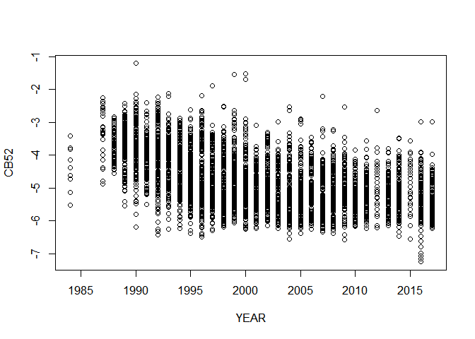<!-- -->

    ## 
    ## Call:
    ## lm(formula = CB52 ~ YEAR)
    ## 
    ## Residuals:
    ##     Min      1Q  Median      3Q     Max 
    ## -2.1596 -0.5417 -0.0524  0.4939  3.1984 
    ## 
    ## Coefficients:
    ##               Estimate Std. Error t value Pr(>|t|)    
    ## (Intercept) 104.773320   2.538382   41.28   <2e-16 ***
    ## YEAR         -0.054745   0.001268  -43.18   <2e-16 ***
    ## ---
    ## Signif. codes:  0 '***' 0.001 '**' 0.01 '*' 0.05 '.' 0.1 ' ' 1
    ## 
    ## Residual standard error: 0.7472 on 5026 degrees of freedom
    ## Multiple R-squared:  0.2706, Adjusted R-squared:  0.2704 
    ## F-statistic:  1865 on 1 and 5026 DF,  p-value: < 2.2e-16

We now show a scatter plot and fitted linear model summary for CB52
versus YEAR from `vB1`. We see that the slope coefficient is -0.0576
with SE = 0.0014 and p-value \< 2e-16; Adjusted R-squared = 0.29.

    ## The following objects are masked from completed_vB1 (pos = 3):
    ## 
    ##     ACCNR, ALDR, CB101, CB118, CB138, CB153, CB180, CB28, CB52, FPRC,
    ##     LAT, LOC, LONG, NHOM, SPECIES, TOTL, TOTV, YEAR

    ## The following objects are masked from CB52_filtered:
    ## 
    ##     CB52, YEAR

    ## The following objects are masked from vB1 (pos = 5):
    ## 
    ##     ACCNR, ALDR, CB101, CB118, CB138, CB153, CB180, CB28, CB52, FPRC,
    ##     LAT, LOC, LONG, NHOM, SPECIES, TOTL, TOTV, YEAR

    ## The following objects are masked from completed_vB1 (pos = 6):
    ## 
    ##     ACCNR, ALDR, CB101, CB118, CB138, CB153, CB180, CB28, CB52, FPRC,
    ##     LAT, LOC, LONG, NHOM, SPECIES, TOTL, TOTV, YEAR

    ## The following objects are masked from CB28_filtered:
    ## 
    ##     CB28, YEAR

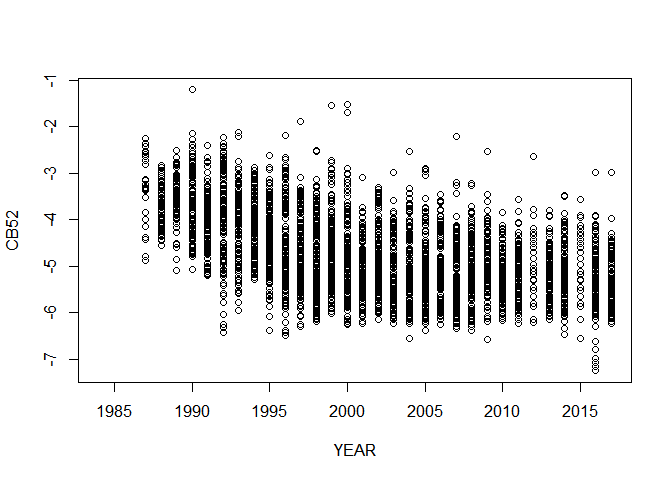<!-- -->

    ## 
    ## Call:
    ## lm(formula = CB52 ~ YEAR)
    ## 
    ## Residuals:
    ##      Min       1Q   Median       3Q      Max 
    ## -2.23298 -0.51793 -0.04857  0.49826  3.14772 
    ## 
    ## Coefficients:
    ##               Estimate Std. Error t value Pr(>|t|)    
    ## (Intercept) 110.509708   2.709073   40.79   <2e-16 ***
    ## YEAR         -0.057588   0.001353  -42.57   <2e-16 ***
    ## ---
    ## Signif. codes:  0 '***' 0.001 '**' 0.01 '*' 0.05 '.' 0.1 ' ' 1
    ## 
    ## Residual standard error: 0.7409 on 4461 degrees of freedom
    ##   (565 observations deleted due to missingness)
    ## Multiple R-squared:  0.2889, Adjusted R-squared:  0.2888 
    ## F-statistic:  1813 on 1 and 4461 DF,  p-value: < 2.2e-16

### Analysis of the trend CB153 vs YEAR

#### Creation and trend analysis for the `CB153_filtered` dataset

We show below a scatter plot and fitted linear model summary for CB153
versus YEAR from `CB153_filtered`; this dataset was created by removal
of censored values. Since this variable has no missing values it is
identical for `CB153_filtered`, `vB1` and `completed_vB1`; the slope
coefficient is -0.0413; SE = 0.0016; p-value \< 2e-16; Adjusted
R-squared = 0.12.

    ## The following objects are masked from vB1 (pos = 3):
    ## 
    ##     CB153, YEAR

    ## The following objects are masked from completed_vB1 (pos = 4):
    ## 
    ##     CB153, YEAR

    ## The following object is masked from CB52_filtered:
    ## 
    ##     YEAR

    ## The following objects are masked from vB1 (pos = 6):
    ## 
    ##     CB153, YEAR

    ## The following objects are masked from completed_vB1 (pos = 7):
    ## 
    ##     CB153, YEAR

    ## The following object is masked from CB28_filtered:
    ## 
    ##     YEAR

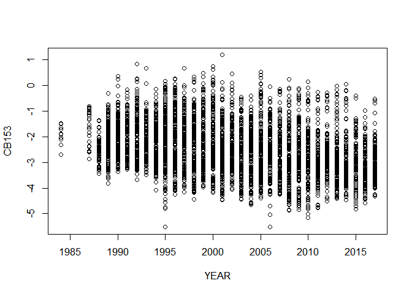<!-- -->

    ## 
    ## Call:
    ## lm(formula = CB153 ~ YEAR)
    ## 
    ## Residuals:
    ##     Min      1Q  Median      3Q     Max 
    ## -3.3203 -0.6700 -0.0917  0.5920  3.6252 
    ## 
    ## Coefficients:
    ##              Estimate Std. Error t value Pr(>|t|)    
    ## (Intercept) 80.281553   3.184614   25.21   <2e-16 ***
    ## YEAR        -0.041345   0.001591  -25.99   <2e-16 ***
    ## ---
    ## Signif. codes:  0 '***' 0.001 '**' 0.01 '*' 0.05 '.' 0.1 ' ' 1
    ## 
    ## Residual standard error: 0.9374 on 5026 degrees of freedom
    ## Multiple R-squared:  0.1185, Adjusted R-squared:  0.1183 
    ## F-statistic: 675.7 on 1 and 5026 DF,  p-value: < 2.2e-16

### Preliminary conclusions

For every fitted model above the p-value was less than 2e-16, so the
significance of the slope coefficient does not allow us to distinguish
between the alternatives explored above, so we will focus solely on the
degree of associated as indicated by the R-squared values.

For CB28 vs YEAR, these values were (0.18, 0.31, 0.29) for
(CB28\_filtered, completed\_vB1, vB1) respectively.

For CB52 vs YEAR, these values were (0.26, 0.27, 0.29) for
(CB52\_filtered, completed\_vB1, vB1) respectively.

For CB153 vs YEAR the value was (0.12, 0.12, 0.12) because this variable
is identical in these three datasets.

The number of observations in (CB28\_filtered, CB52\_filtered,
CB153\_filtered, completed\_vB1, vB1) is (2281, 3234, 5028, 5028, 5028)
respectively.

We see that CB153 has the lowest R-squared value. This is as we may have
conjectured since this there are no censored values to substitute (using
LOQ/sqrt(2)), so variance is not artificially reduced in this manner.
However, CB28 has more censored values than CB52 and a higher R-squared
value, which constitutes evidence against this conjecture.

Comparing CB28 and CB52: we see that the `CB28_filtered` dataset has the
fewest observations and resulted in the lowest R-squared value. We also
see that the R-squared values for `vB1` and `completed_vB1` are very
similar (in fact, equal on average); recall that these datasets both
have censored values substituted by LOQ/sqrt(2) and differ only in the
fact that the NA values in vB1 are substituted by values generated by
multiple imputation from the mice() algorithm. Concretely, the number of
NA values in vB1 for (CB28, CB52) is (631, 565) respectively, whereas
there are no NA values in completed\_vB1.

### Comparison of the strength of association between x=YEAR and y=CB28 by application of exclusion, regression imputation, and use of cenreg() to censored values

We will use a streamlined version of the methodology described in our
document “Preliminary studies of censored data”

From the below output, we see that the value of likelihood-r for
`tib3_cenreg_28` was 0.425 (and 0.425^2=0.181).

    ## Loading required package: survival

    ## 
    ## Attaching package: 'NADA'

    ## The following object is masked from 'package:stats':
    ## 
    ##     cor

    ## Warning in Surv(start, end, type = "interval2"): Invalid interval: start > stop,
    ## NA created

    ##                        Value Std. Error     z         p
    ## (Intercept)          64.0360    3.08567  20.8  1.16e-95
    ## pcb_tib3_CB28CI$YEAR -0.0346    0.00154 -22.4 3.61e-111
    ## Log(scale)           -0.5635    0.01481 -38.1  0.00e+00
    ## 
    ## Scale = 0.569 
    ## 
    ## Gaussian distribution
    ## Loglik(model)= -1950.4   Loglik(intercept only)= -2177.2 
    ## Loglik-r:  0.4247652 
    ## 
    ## Chisq= 453.65 on 1 degrees of freedom, p= 0 
    ## Number of Newton-Raphson Iterations: 4 
    ## n =2280 (2117 observations deleted due to missingness)

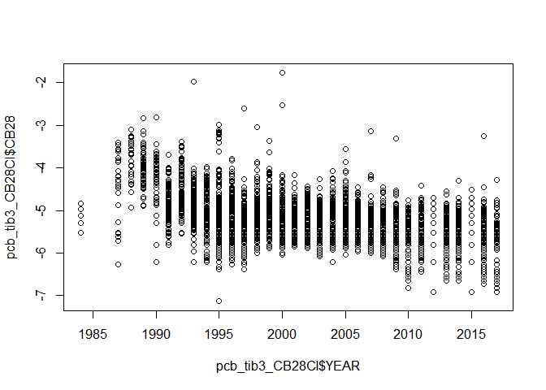<!-- -->

We will now use the methodology documented in “Cleaning the pcb dataset”
to substitute the CB28 censored values with values predicted by the
regression equation of the linear model `vB1_CB28_YEAR_fit` described
above.

We get Adjusted R-squared = 0.384, which is slightly higher than
resulted from the method of the previous section. However, this is as we
expected because substitution using predicted values has given plotted
points that lie on the regression line so the increase in R-squared is
at the expense of unrealistic alignment of the substituted points. See
our document “Preliminary studies of censored data” to see how such
alignment can be eliminated by the addition of noise.

    ## Warning in log(CB28): NaNs produced

    ## 
    ## Call:
    ## lm(formula = pcb_tib3_CB28LMpredSUB1$CB28 ~ pcb_tib3_CB28LMpredSUB1$YEAR)
    ## 
    ## Residuals:
    ##     Min      1Q  Median      3Q     Max 
    ## -2.1748 -0.0599 -0.0445  0.0626  3.3878 
    ## 
    ## Coefficients:
    ##                                Estimate Std. Error t value Pr(>|t|)    
    ## (Intercept)                  77.2274468  1.5762746   48.99   <2e-16 ***
    ## pcb_tib3_CB28LMpredSUB1$YEAR -0.0411948  0.0007868  -52.35   <2e-16 ***
    ## ---
    ## Signif. codes:  0 '***' 0.001 '**' 0.01 '*' 0.05 '.' 0.1 ' ' 1
    ## 
    ## Residual standard error: 0.4141 on 4395 degrees of freedom
    ## Multiple R-squared:  0.3841, Adjusted R-squared:  0.384 
    ## F-statistic:  2741 on 1 and 4395 DF,  p-value: < 2.2e-16

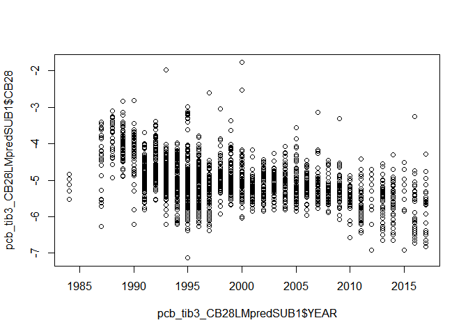<!-- -->

We will now exclude the observations for which the value of CB28 is
censored and fit a linear model and compare with our previous results.
The resulting fitted model has coefficients (64.0360, -0.0346) and
Adjusted-R-squared = 0.180; these coefficients are then used to make
predictions, which are substituted and then the linear model is fit as
above. The resulting fitted model has coefficients (67.17611, -0.03615)
and Adjusted-R-squared = 0.328.

    ## 
    ## Call:
    ## lm(formula = pcb_tib3_CB28lmEXCLUDE$CB28 ~ pcb_tib3_CB28lmEXCLUDE$YEAR)
    ## 
    ## Residuals:
    ##     Min      1Q  Median      3Q     Max 
    ## -2.1890 -0.3766 -0.0124  0.3258  3.3405 
    ## 
    ## Coefficients:
    ##                              Estimate Std. Error t value Pr(>|t|)    
    ## (Intercept)                 64.036037   3.087028   20.74   <2e-16 ***
    ## pcb_tib3_CB28lmEXCLUDE$YEAR -0.034575   0.001544  -22.39   <2e-16 ***
    ## ---
    ## Signif. codes:  0 '***' 0.001 '**' 0.01 '*' 0.05 '.' 0.1 ' ' 1
    ## 
    ## Residual standard error: 0.5695 on 2278 degrees of freedom
    ## Multiple R-squared:  0.1804, Adjusted R-squared:  0.1801 
    ## F-statistic: 501.5 on 1 and 2278 DF,  p-value: < 2.2e-16

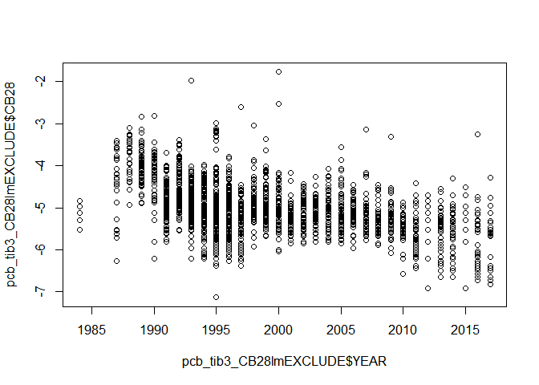<!-- -->

    ## Warning in log(CB28): NaNs produced

    ## 
    ## Call:
    ## lm(formula = pcb_tib3_CB28lmEXCLUDE_predSUB$CB28 ~ pcb_tib3_CB28lmEXCLUDE_predSUB$YEAR)
    ## 
    ## Residuals:
    ##     Min      1Q  Median      3Q     Max 
    ## -2.1783 -0.0353 -0.0182  0.0328  3.3591 
    ## 
    ## Coefficients:
    ##                                     Estimate Std. Error t value Pr(>|t|)    
    ## (Intercept)                         67.17611    1.56258   42.99   <2e-16 ***
    ## pcb_tib3_CB28lmEXCLUDE_predSUB$YEAR -0.03615    0.00078  -46.35   <2e-16 ***
    ## ---
    ## Signif. codes:  0 '***' 0.001 '**' 0.01 '*' 0.05 '.' 0.1 ' ' 1
    ## 
    ## Residual standard error: 0.4105 on 4395 degrees of freedom
    ## Multiple R-squared:  0.3283, Adjusted R-squared:  0.3282 
    ## F-statistic:  2149 on 1 and 4395 DF,  p-value: < 2.2e-16

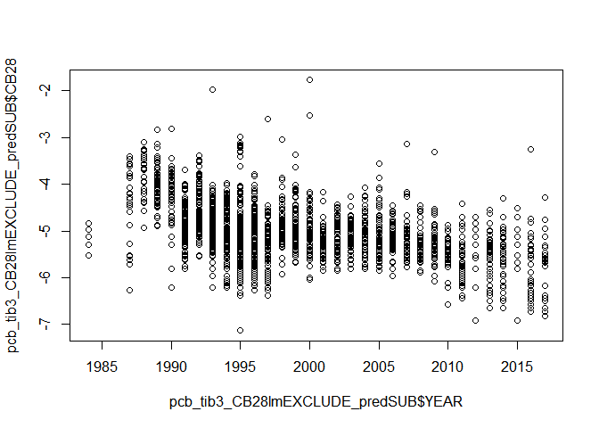<!-- -->

In summary, three main approaches were tried: exclusion; substitution
using regression imputation; use of cenreg(). The adjusted-R-squared
values were reported for each case and found to have similar values when
exclusion and regression imputation were used. However, for the cenreg()
method, the value of likelihood-r was reported and its squared value was
found to be lower than the adjusted R-squared values from the other
approaches. Weaker association after using cenreg() was not found in our
document “Preliminary studies of censored data”; our preliminary
explanation is to attribute this relative failure here to the larger
proportion of censored data for the CB28 variable than for the variables
used in our previous document.
